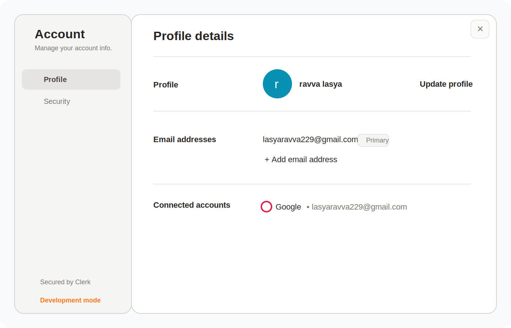
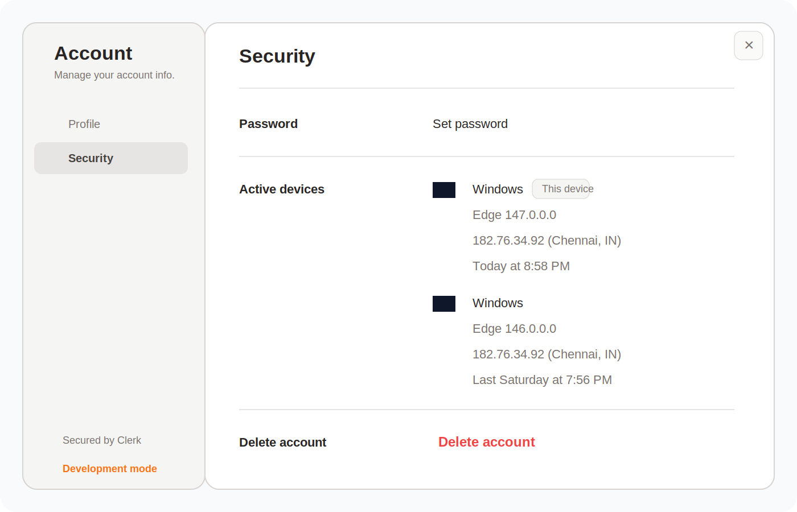
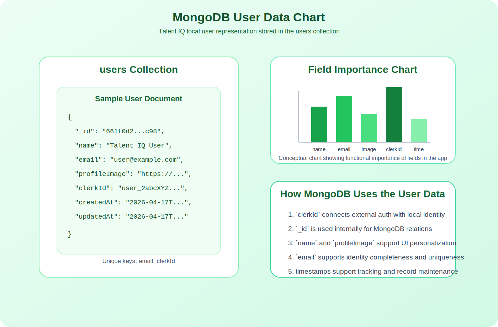
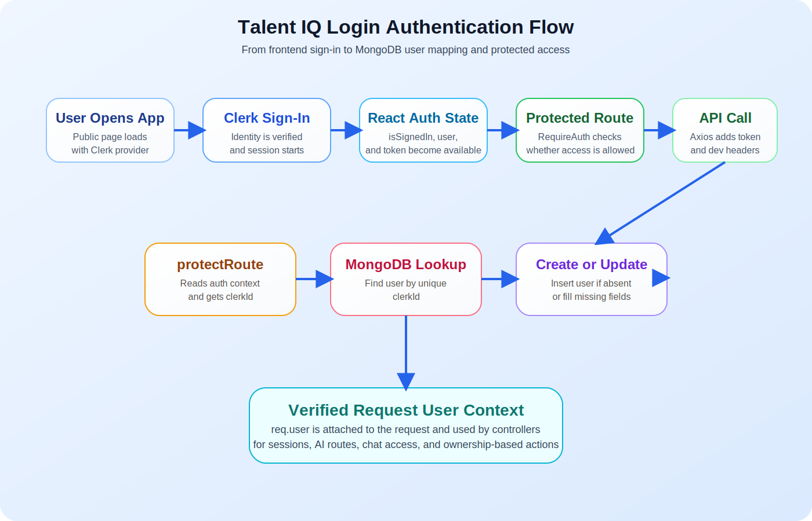
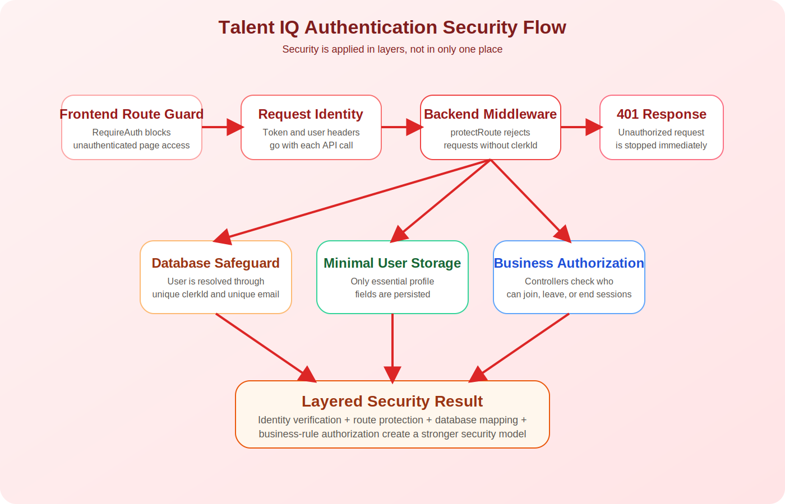

# Chapter 3: Login Authentication, Methodology, Security, and MongoDB User Data

## 3.1 Introduction

Authentication is one of the most important foundational modules in any modern web application. In a platform like Talent IQ, which includes coding practice, collaborative sessions, personalized dashboards, AI-based features, and protected user workflows, authentication is not just a login button. It is the mechanism that establishes identity, controls access, connects user actions to stored records, and protects the integrity of the platform.

In practical terms, the login and authentication system answers several core questions:

- Who is the current user?
- Is the user allowed to access a protected route?
- How does the frontend prove the user’s identity to the backend?
- How is the authenticated user represented inside MongoDB?
- How does the system protect user-specific features from unauthorized access?

In Talent IQ, authentication is implemented through Clerk on the frontend and backend identity processing through middleware on the server side. The frontend handles sign-in state, token retrieval, and protected route navigation. The backend validates identity context, locates the corresponding MongoDB user record, creates one when needed, updates missing values when necessary, and then attaches the user to the request lifecycle.

This chapter explains the authentication architecture, its working methodology, the security model around it, and the MongoDB user data structure that supports the platform. The chapter is intentionally detailed because authentication is central to both software reliability and user trust.

## 3.2 Purpose of the Authentication Module

The authentication module in Talent IQ serves multiple goals at the same time. First, it prevents unauthorized users from accessing sensitive or personalized pages such as the dashboard, session pages, AI coach endpoints, and problem practice routes. Second, it allows the application to personalize actions according to the current user. Third, it supports continuity, because users can return to the platform and find their sessions and features associated with their own identity.

Another important purpose of the module is cross-service identity consistency. Talent IQ does not use authentication only for page restriction. The authenticated identity is also used when interacting with:

- MongoDB user records
- Stream session membership
- chat-related functionality
- session ownership logic
- protected backend APIs

This means the authentication layer becomes the identity backbone of the entire system.

## 3.3 Why Authentication Is Important in Talent IQ

The Talent IQ platform contains several user-specific operations. For example, a user can create a session, join a session, view active sessions, view recent sessions, use AI tools, and enter protected coding pages. If authentication were absent or weak, the system would face several risks:

- unauthorized access to protected pages
- impersonation of another user
- incorrect mapping of users in live sessions
- exposure of personalized resources
- inconsistent database records

From an academic perspective, authentication is also important because it demonstrates how a full-stack system manages identity across the frontend, backend, and database. In smaller demo applications, authentication is often oversimplified. In Talent IQ, however, it is integrated into multiple workflows, making it a strong example of real application architecture.

## 3.4 Technology Used for Authentication

The project uses Clerk as the authentication service on the frontend and Express-side identity resolution on the backend. MongoDB stores the local representation of the authenticated user through the `User` model.

The main implementation pieces are:

- `frontend/src/main.jsx`
  Clerk provider setup for the React app
- `frontend/src/App.jsx`
  frontend route protection and auth state integration
- `frontend/src/lib/axios.js`
  token and user headers attached to outgoing API requests
- `backend/src/middleware/protectRoute.js`
  backend authorization guard and user synchronization
- `backend/src/models/User.js`
  MongoDB user schema
- `backend/src/routes/sessionRoute.js`
  example of protected backend routes

This distributed implementation shows that authentication is not a single file or event. It is a coordinated system across multiple layers.

## 3.5 High-Level Authentication Workflow

At a high level, the login and authentication flow of Talent IQ works as follows:

1. The user opens the application.
2. Clerk provides sign-in and user session management on the frontend.
3. After login, the frontend knows whether the user is signed in.
4. Protected routes check that sign-in state before rendering secure pages.
5. When the frontend sends an API request, it attaches an authorization token and development identity headers.
6. The backend middleware reads the auth context.
7. The backend identifies the Clerk user ID.
8. The backend searches MongoDB for a user with that `clerkId`.
9. If the user does not exist, a new MongoDB user document is created.
10. If the user exists but some important fields are missing, the record is updated.
11. The resolved user document is attached to `req.user`.
12. The protected controller executes using the verified user context.

This workflow ensures that each protected backend action is associated with a persistent local user entity in MongoDB.

## 3.6 Frontend Login Methodology

### 3.6.1 Clerk Initialization

The authentication journey begins at the frontend entry point. The React application is wrapped using the Clerk provider. This makes authentication state available throughout the app and allows components to use Clerk hooks such as:

- `useUser()`
- `useAuth()`
- `SignInButton`

This provider-based pattern is useful because it centralizes authentication availability without forcing manual state propagation across the component tree.

### 3.6.2 Sign-In Trigger

The sign-in experience is exposed through components such as `SignInButton` in the public pages. For example, the home page and services page include direct sign-in actions. This keeps authentication user-friendly by exposing login only where it is contextually needed rather than making the user search for it.

### 3.6.3 Auth State in the Application

The application uses Clerk’s hooks to determine whether the user is authenticated. In `frontend/src/App.jsx`, the system reads:

- `isSignedIn`
- `isLoaded`
- `user`
- `getToken`

These values shape two major behaviors:

- protected rendering
- authenticated API communication

If authentication state is not yet loaded, the app returns `null` temporarily to avoid incorrect rendering flicker. This is a subtle but important usability decision because it prevents protected content from appearing briefly before the auth state is fully resolved.

### 3.6.4 Protected Route Methodology

The frontend uses a `RequireAuth` wrapper for protected routes. If the user is authenticated, the route renders normally. If not, the app redirects to the root route and preserves the intended destination through a `redirect` query parameter.

This creates a clean workflow:

- unauthenticated user requests a protected route
- app stores intended destination
- app redirects to sign-in entry
- after sign-in, user is returned to the intended protected route

This methodology improves both security and user experience.

## 3.7 Backend Authentication Methodology

### 3.7.1 The Role of `protectRoute`

The backend uses `protectRoute` middleware to secure API routes. This middleware performs the main identity-processing logic of the system. Its responsibilities include:

- reading the authentication context from Clerk
- supporting development header fallback in non-production mode
- identifying the `clerkId`
- rejecting requests without valid identity
- finding or creating the MongoDB user
- filling missing user fields where needed
- attaching the resolved user object to `req.user`

This means authentication on the backend is not just token checking. It is also local user synchronization.

### 3.7.2 Auth Context Extraction

The middleware tries to obtain the auth context through Clerk’s server-side helpers. If that fails, it falls back to `req.auth()` or `req.auth`. This flexible implementation increases robustness by supporting the auth context through multiple compatible mechanisms.

The middleware then determines whether the app is in development mode. If so, it can also accept development identity headers:

- `x-dev-clerk-user-id`
- `x-dev-user-email`
- `x-dev-user-name`
- `x-dev-user-image`

These headers are not the primary production mechanism. They act as a development support path so that local identity flow remains functional during development and integration.

### 3.7.3 Unauthorized Request Handling

If neither the Clerk auth context nor the development headers provide a usable `clerkId`, the middleware returns an HTTP `401 Unauthorized` response. This is a direct and essential access-control decision. The backend does not allow the request to continue without verified user identity.

### 3.7.4 MongoDB User Resolution

Once the `clerkId` is known, the middleware searches MongoDB:

- if a user with the same `clerkId` exists, that user becomes the request user
- if not, a new user document is created

This means Clerk is used for authentication identity, while MongoDB is used for local application identity persistence. This is a common and effective pattern in modern systems where an external auth provider manages sign-in and the application manages its own local user records.

### 3.7.5 User Auto-Creation Logic

If the user is not already in MongoDB, the middleware creates one using the best available information:

- email from session claims or development header
- name from full name, claim-based name, or fallback logic
- profile image from claims or header
- `clerkId` as the stable external identity key

This design reduces onboarding friction because the application does not require a separate manual registration form after authentication.

### 3.7.6 User Auto-Update Logic

Even if a user already exists, the middleware checks whether essential fields are missing and fills them using fallback values. For example:

- missing `clerkId`
- missing email
- missing name
- missing profile image

This keeps the local user record usable even if older documents are incomplete or created under partial data conditions.

## 3.8 Methodology of How the Authentication System Works in Practice

The methodology of the authentication system can be understood as a layered trust process.

### Layer 1: Identity Capture
The user signs in through Clerk. At this point, the platform obtains a trusted session state from the authentication provider.

### Layer 2: Frontend Access Control
The React application uses auth state to decide whether protected pages such as dashboard, problems, session pages, AI pages, and resume checker can be accessed.

### Layer 3: Request Authentication
Whenever the frontend calls the backend, Axios injects the token and identity-related headers. This allows backend requests to carry identity proof rather than relying only on browser-side route checks.

### Layer 4: Backend Verification
The backend middleware verifies that the request contains a usable user identity. If verification fails, access stops immediately.

### Layer 5: Local User Mapping
The verified external identity is mapped to a MongoDB user record. This creates continuity between authentication and application data.

### Layer 6: Business Logic Authorization
Once `req.user` exists, controllers apply their own domain logic. For example:

- only the host can end a session
- session membership is determined by the authenticated user
- only authenticated users can view their active sessions

This layered methodology is strong because it does not assume that one security check is enough. Instead, it combines frontend checks, backend checks, and business-rule checks.

## 3.9 Authentication and Session-Based Features

In Talent IQ, authentication interacts directly with the session-management system. The current authenticated user is important for:

- creating a session as host
- joining a session as participant
- identifying host versus participant roles
- linking Stream membership to the correct user
- loading only the user’s active and recent sessions

For example, when a session is created, the backend uses `req.user._id` for MongoDB host association and `req.user.clerkId` for Stream identity integration. This dual use shows how authentication connects internal persistence with external real-time services.

Without reliable authentication, session ownership would become ambiguous and real-time collaboration features would be much harder to secure correctly.

## 3.10 Security of the Authentication System

### 3.10.1 Access Control Security

Security begins with route restriction. Protected frontend routes prevent casual unauthorized navigation, while protected backend routes prevent direct API misuse. The backend route protection is especially critical because frontend protection alone is never sufficient for real security.

The following route groups are protected through middleware:

- session routes
- chat routes
- AI routes

This ensures that important actions are guarded at the API level.

### 3.10.2 Identity Validation Security

The system depends on a trusted Clerk identity source and extracts a `userId` from that context. Since controllers depend on `req.user`, unauthorized requests are blocked before sensitive business logic is executed.

This is stronger than passing a user ID manually from the client, because the backend does not trust arbitrary user identifiers sent in normal request bodies.

### 3.10.3 Database Security Through Controlled Mapping

MongoDB user records are not created using free-form client-controlled registration fields alone. Instead, they are tied to the authenticated `clerkId`. This reduces identity duplication risk and provides a stable mapping key between auth provider and local database.

The `User` schema also enforces uniqueness on:

- `email`
- `clerkId`

This adds a database-level safeguard against accidental duplication.

### 3.10.4 Security Through Least Exposure

The local user schema stores only essential identity information:

- name
- email
- profile image
- `clerkId`
- timestamps

This limited storage approach is beneficial because it avoids unnecessary collection of sensitive personal data. Storing only what is needed helps reduce privacy risk and simplifies data management.

### 3.10.5 CORS and Request-Bound Security

The backend configures CORS to limit allowed origins. In production, the expected client URL is explicitly controlled through environment configuration. During development, localhost origins are handled more flexibly. This protects the backend from being freely called by arbitrary browser origins under normal deployment conditions.

The frontend Axios instance also uses `withCredentials: true`, allowing cookies to be included when appropriate. This supports session-aware communication in environments where credentialed requests matter.

### 3.10.6 Security at the Business Logic Level

Security is not complete after authentication alone. Business rules must still verify whether the authenticated user is authorized to perform a specific action. The session controllers show this clearly:

- a host cannot simply “leave” as a participant; the host must end the session
- only the host can end the session
- users cannot join full sessions
- users cannot join completed sessions

This is an important security lesson: authentication proves identity, while authorization decides what that identity may do.

## 3.11 Manage Account Module

The Manage Account module is an important extension of the authentication chapter because login security does not end once the user enters the application. A modern authentication system must also give users visibility and control over their own account information. In Talent IQ, this account-management experience is handled through Clerk’s account interface, where the user can review profile information and manage security-related settings.

From a documentation perspective, the Manage Account screen is significant because it shows the user-facing side of identity management. While backend middleware, tokens, and database mapping operate behind the scenes, the account screen represents the visible control layer through which users interact with their identity settings.

The account-management interface shown in the project supports two broad categories:

- profile management
- security management

These two categories together complete the lifecycle of identity in the application. Profile management focuses on who the user is. Security management focuses on how that identity is protected.

## 3.12 Profile Management in the Manage Account Section

The profile section allows the user to manage the personal identity information associated with the account. Based on the shared account screenshot, the profile area includes:

- profile name
- profile image or initials-based avatar
- primary email address
- option to add another email address
- connected account information such as Google sign-in

This module is important because user identity in modern systems is not static. Users may want to update their display name, revise profile representation, change or add email addresses, and maintain consistency between the platform and linked identity providers.

From a system-design perspective, the profile page plays several roles:

1. It improves user trust by making stored identity information visible.
2. It supports account maintenance without requiring developer intervention.
3. It helps keep the authentication provider’s identity data up to date.
4. It gives the user confidence that their account details are manageable and transparent.

In educational and collaborative systems like Talent IQ, profile visibility also affects social usability. Since the platform includes session participation and collaboration-related functionality, recognizable user identity improves communication and accountability.

### 3.12.1 Academic Importance of Profile Management

In report terms, profile management can be understood as the identity-presentation layer of the authentication system. Authentication answers the question “Is this user valid?” Profile management answers the question “How is this user represented inside the system?”

This distinction is useful because many projects discuss login but ignore identity maintenance. A more complete authentication design includes profile visibility, identity correction, and connected-account management. The presence of a profile-management screen therefore strengthens the project’s practical completeness.

### 3.12.2 Explanation of the Profile Screenshot

In the profile view, the user can see their account information under the “Profile details” area. The displayed avatar, username, and email information help establish clarity and identity continuity. The interface also shows connected account information, which demonstrates that external identity providers can be linked to the account.

This design is beneficial because it reduces ambiguity. The user does not have to guess which email is active, which account is linked, or what personal information is currently associated with the system. Clear presentation improves confidence and reduces account-related confusion.

Figure 3.4: Manage Account profile view

## 3.13 Security Management in the Manage Account Section

The security tab of the account-management interface is highly relevant to this chapter because it brings authentication and security together in a direct user-facing form. Based on the provided screenshot, the security page includes:

- password setup or password management
- active device list
- device and browser visibility
- session/device location display
- current-device identification
- account deletion control

This is a strong feature from a security perspective because it shifts some protective awareness to the user. The system is not only protecting the user silently in the backend; it is also giving the user the ability to inspect their own account state.

### 3.13.1 Role of Active Devices

The active-devices section is especially important in authentication security. It allows the user to see where the account is currently or recently active. This has several benefits:

- suspicious access can be detected more easily
- users can recognize unknown devices or sessions
- the current device can be identified clearly
- the account’s session footprint becomes more transparent

In theoretical terms, this is an example of account-session observability. Observability means making system state visible in a useful way. In this case, the user is able to observe the session-level behavior of their own account.

### 3.13.2 Password and Credential Security

The security screen includes password setup or password management options. This is important because authentication security depends not only on session tokens and backend middleware, but also on credential hygiene. When users can review or set their password settings, the platform becomes more secure and more self-manageable.

The presence of linked providers and password options also suggests support for flexible authentication models. In practice, some users may depend on Google-based login, while others may prefer email-and-password credentials. Good account management supports this diversity without confusing the user.

### 3.13.3 Delete Account Option

The account deletion option is also meaningful from a documentation and privacy perspective. It reflects user control over their own account lifecycle. In many software systems, privacy and autonomy are strengthened when users are allowed to remove their account rather than being permanently locked into the system.

For project documentation, this shows that the authentication ecosystem is not limited to entry access. It also includes exit control, session visibility, and identity maintenance.

### 3.13.4 Explanation of the Security Screenshot

In the security view, the user can see security-related controls in a clean and structured layout. The current device is marked distinctly, and recent devices are listed with browser, approximate location, and access time information. This makes the interface useful not only for configuration but also for user assurance.

A well-designed security-management page reduces anxiety because it allows the user to confirm that the account is behaving as expected. If something looks unusual, the user can respond more quickly. This kind of transparency is an important part of practical account security.

Figure 3.5: Manage Account security view

## 3.14 How Manage Account Complements Authentication

The Manage Account feature complements the authentication module in several important ways.

First, it extends identity handling beyond the login event. Authentication is often wrongly treated as a one-time interaction, but in practice identity management is continuous. Users may change profile details, review devices, update credentials, or connect external accounts long after the initial login.

Second, it improves user control. The backend and middleware protect the system technically, but the account-management interface protects the user operationally by giving them visibility into their own account state.

Third, it supports trust and professionalism. A platform that includes account-management screens appears more complete, more transparent, and more reliable than one that only offers a hidden login flow without user-facing identity controls.

Fourth, it reflects real-world authentication design. In modern digital platforms, account management, active-session visibility, credential controls, and connected-account review are part of a mature authentication ecosystem. The inclusion of this functionality therefore strengthens the practical relevance of Talent IQ.

## 3.15 Relationship Between Manage Account and MongoDB User Data

Although Clerk manages the account interface and external identity controls, the Talent IQ backend still stores its own local user document in MongoDB. This creates an important distinction:

- Clerk manages authentication identity and account settings
- MongoDB stores the application’s internal user representation

This means that the profile and security screens are not a replacement for MongoDB persistence. Instead, they operate alongside it. Clerk handles account-level identity operations, while MongoDB supports application-level relations such as session ownership, personalization, and internal referencing.

This layered model is useful because it separates concerns:

- the auth provider handles secure identity lifecycle tasks
- the application database handles local workflow persistence

That separation improves maintainability and reduces the complexity of building a custom account-management system from scratch.

## 3.11 Methodology of Secure User Data Handling in MongoDB

MongoDB acts as the local persistence layer for user identity inside the application. However, MongoDB is not treated as the source of sign-in truth. Instead, it functions as the application’s internal user registry.

The methodology of user storage is:

1. receive authenticated identity from Clerk
2. search MongoDB by `clerkId`
3. create the document if it does not exist
4. update missing fields if needed
5. attach that document to all protected request workflows

This design has several advantages:

- no duplicate local registration flow is required
- every protected user action is linked to a MongoDB record
- external identity and local application identity remain synchronized
- session and analytics logic can depend on stable database users

The `User` schema is simple but effective. It stores a clean profile layer that is enough for personalization, ownership, and referencing.

## 3.16 MongoDB User Schema Explanation

The MongoDB user model in Talent IQ includes the following fields:

- `name`
  the display name of the user
- `email`
  unique email value for user identity support
- `profileImage`
  optional user image URL
- `clerkId`
  unique external authentication identity key
- `createdAt`
  timestamp for document creation
- `updatedAt`
  timestamp for latest update

This schema is intentionally compact. It is designed to support core workflow requirements rather than collect excessive profile information.

From a system design viewpoint, `clerkId` is the most important bridge field because it links the external authentication world to the internal MongoDB world.

## 3.17 MongoDB User Data Chart

The following figure represents how user data is conceptually stored in the MongoDB `users` collection.

Figure 3.1: MongoDB user document structure

The next figure shows the data flow between Clerk identity and MongoDB user persistence.

Figure 3.2: Authentication to MongoDB mapping flow

The next figure shows the security-oriented request path for protected API access.

Figure 3.3: Authentication security flow

## 3.18 Chart-Based Interpretation of User Data in MongoDB

The user data chart can be interpreted as a persistence map rather than only a database schema. Each authenticated user enters the application through Clerk, but the platform needs its own internal reference to support sessions, AI tools, and activity ownership. MongoDB therefore acts as the application memory for authenticated users.

In simple terms:

- Clerk proves who the user is
- MongoDB remembers that user inside the application
- controllers use that remembered identity for feature execution

The chart is especially important in documentation because it visually shows how authentication is not isolated from the database. Instead, it results in structured user persistence that the rest of the system depends on.

## 3.19 Strengths of the Implemented Authentication Design

The current authentication design has several strengths:

- it uses a trusted external authentication provider
- it protects both frontend and backend layers
- it automatically creates and updates MongoDB user records
- it integrates well with session and Stream-based features
- it uses a clean and minimal user schema
- it separates authentication from business authorization

These strengths make the current design suitable for a modern educational collaboration platform.

## 3.20 Limitations and Future Security Improvements

Although the current authentication design is strong for the project scope, there are several possible future improvements:

- stronger role-based authorization if admin or mentor roles are added
- audit logging for sensitive actions
- stricter production-only validation of development headers
- user activity analytics on secure dashboards
- advanced anomaly detection for repeated failed access attempts
- broader privacy controls for user profile visibility

These do not indicate weaknesses in the current system so much as natural growth directions for a more production-mature platform.

## 3.21 Methodology Summary

The methodology of the authentication system in Talent IQ can be summarized as:

- authenticate the user through Clerk
- expose auth state to React using provider and hooks
- protect routes on the frontend
- attach identity context to backend requests using Axios
- verify identity in Express middleware
- create or update local MongoDB user records
- pass verified user context to protected controllers
- apply feature-level authorization rules inside business logic

This methodology is strong because it is layered, modular, and practical. It combines usability with security and ensures that all protected actions are grounded in verified identity.

## 3.22 Extended Chapter Summary

This chapter has shown that authentication in Talent IQ is not limited to login verification. It is a multi-layered system that includes frontend sign-in handling, backend route protection, MongoDB user mapping, security enforcement, session-based authorization, and user-facing account management. Each layer contributes to trust, usability, and system stability.

The addition of the Manage Account module makes the chapter more complete because it highlights the user-visible side of authentication. The profile view supports identity transparency and connected-account management, while the security view supports password control, device awareness, and account-level safety. These features demonstrate that the authentication design is not only technically functional but also user-centered.

At the database level, MongoDB preserves a clean local representation of the authenticated user. At the security level, layered verification and authorization protect routes and actions. At the usability level, Clerk-based account management makes identity handling understandable and maintainable for the user. Together, these parts form a practical and well-structured authentication ecosystem for the Talent IQ platform.

## 3.23 Chapter Summary

This chapter explained the login authentication system of Talent IQ in detail. The platform uses Clerk for authentication, React for protected frontend flow, Axios for authenticated request propagation, Express middleware for backend verification, and MongoDB for local user persistence. The methodology is based on identity capture, route protection, backend validation, and user-document mapping.

From a security perspective, the system protects both pages and APIs, limits unauthorized access, applies business-rule authorization, and maintains stable user mapping through `clerkId`. From a data perspective, MongoDB stores a clean local user representation that supports personalization, session management, and platform continuity.

Overall, the authentication module is not only a login feature but a core infrastructure layer that supports trust, ownership, security, and user-specific workflow across the Talent IQ platform.
