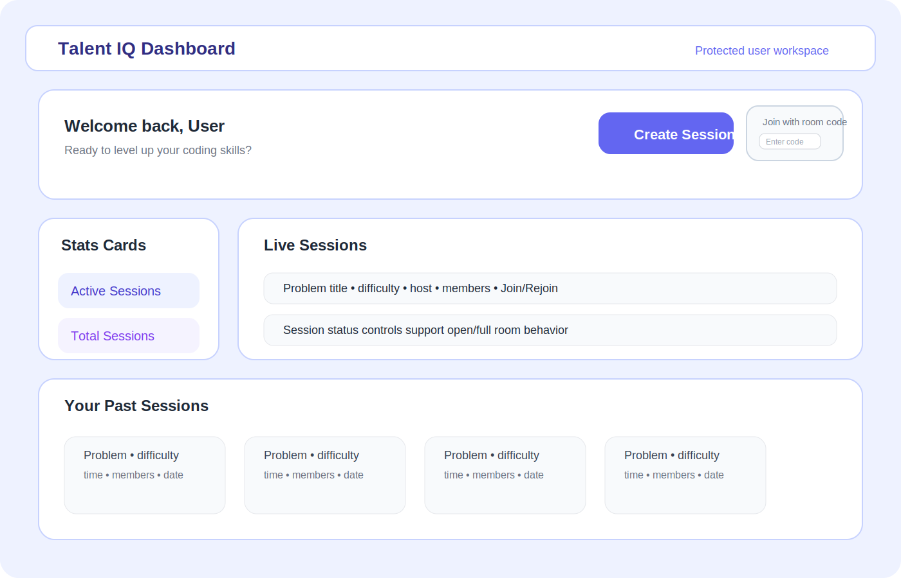
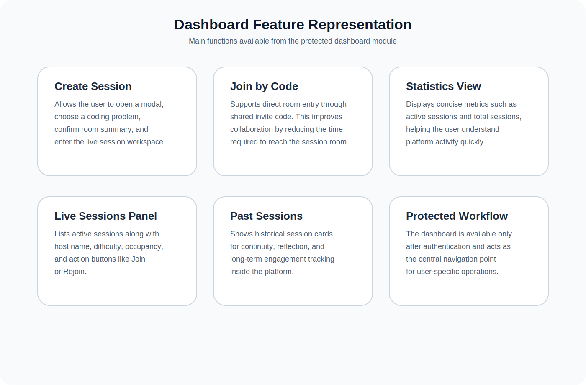
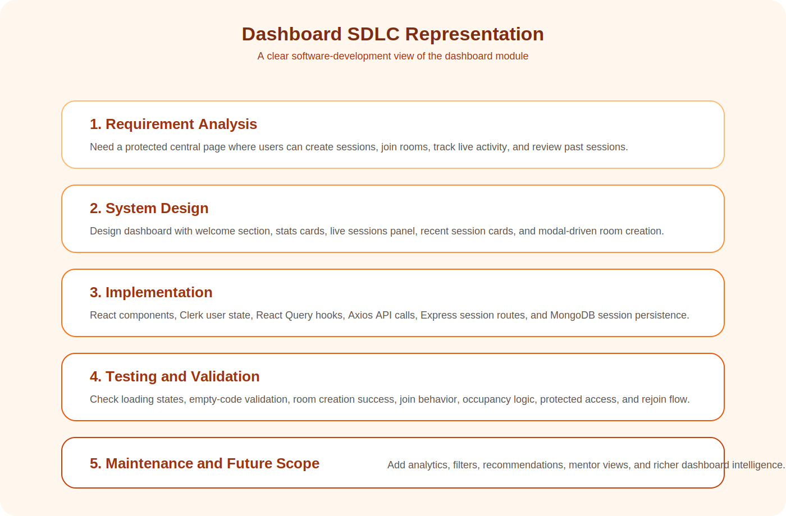

# Chapter 4: Dashboard Workflow, Features, Software Used, and SDLC-Based Representation

## 4.1 Introduction

The dashboard is one of the most important operational modules of the Talent IQ platform. While the home page introduces the system and the problem-solving pages support direct coding practice, the dashboard acts as the control center from which the authenticated user enters the main workflow of the application. It is the point where identity, navigation, collaboration, and activity history come together.

In practical software systems, a dashboard is more than a visual page. It is a decision surface. It brings together the information a user needs most frequently and transforms separate actions into a structured and manageable workflow. In Talent IQ, the dashboard helps users do the following:

- start a new collaborative coding session
- join an existing session using a room code
- monitor active sessions
- view previous sessions
- understand current platform activity at a glance

This chapter explains the dashboard in detail, including its purpose, feature structure, workflow methodology, software technologies used, and the way it can be interpreted using an SDLC-style representation. The goal is to present the dashboard in a clear and academically understandable format so that it can be used directly in project documentation or report submission.

## 4.2 Importance of the Dashboard in Talent IQ

The dashboard is important because it transforms the application from a collection of isolated features into an organized user experience. Without the dashboard, the user would need to navigate directly to individual modules, remember session paths, or manually search for the next action. The dashboard solves this problem by centralizing the most relevant user actions.

From a functional perspective, the dashboard plays three major roles:

1. It acts as an entry point to session-based collaboration.
2. It acts as a summary board for current and past activity.
3. It acts as a transition layer between authentication and task execution.

In other words, the dashboard is where the user moves from being merely logged in to becoming actively engaged in the platform. This is why the dashboard should be understood not simply as a page but as a workflow orchestrator.

From a user-experience perspective, the dashboard also reduces mental load. Instead of scattering functionality across multiple pages without context, the dashboard organizes actions according to natural user intent: create, join, monitor, and review.

## 4.3 Objective of the Dashboard Module

The dashboard module is designed with several objectives:

- to provide a welcoming and personalized user experience after authentication
- to allow fast creation of collaborative coding sessions
- to enable room-code-based joining of sessions
- to display current active session status
- to preserve continuity by showing recent session history
- to give the user summary indicators for platform usage

These objectives are significant because they align with the real behavior of users preparing for technical interviews or collaborative coding practice. Such users do not only want to read static information; they want to act quickly, re-enter previous work, and move through the system efficiently.

## 4.4 Actual Dashboard Components in the Project

Based on the current implementation, the dashboard is composed of the following major sections:

- navigation bar
- welcome section
- create session action
- join with room code section
- active session statistics
- recent session statistics
- live sessions panel
- past sessions panel
- create session modal

These sections work together as a layered interaction model rather than isolated visual blocks.

## 4.5 Welcome Section

The dashboard begins with a personalized welcome section. This part uses authenticated user information from Clerk and greets the user by first name where available. It also provides a motivational statement that encourages continued coding practice and engagement.

This section serves a psychological as well as functional purpose. A dashboard is usually the first protected page the user sees after authentication. Therefore, the top section should:

- confirm that the user has entered the correct personalized area
- provide immediate access to the most common actions
- create a positive and active first impression

The welcome area in Talent IQ includes two high-priority actions:

- Create Session
- Join with room code

This is an example of action-first dashboard design, where the dashboard immediately supports the user’s next step rather than forcing them to explore a complex menu structure.

## 4.6 Create Session Workflow

One of the most important dashboard features is session creation. The “Create Session” button opens a modal that allows the user to configure a new coding room. This process includes:

- choosing a problem
- automatically mapping the selected difficulty
- showing a session summary
- creating the session through a backend mutation
- receiving session identifiers and invite code
- storing live session information in browser session storage
- redirecting the user to the created session page

This workflow is well designed because it transforms a complex backend process into a simple guided interface. The user sees a modal, selects a problem, confirms the action, and is taken to the correct live session context.

From a software engineering perspective, this workflow demonstrates the connection between UI state management, backend communication, and navigation control. The frontend handles modal state and user input, while the backend creates the session record and related service structures.

## 4.7 Join with Room Code Workflow

Another important dashboard feature is the “Join with room code” mechanism. Instead of forcing users to search manually for sessions or rely on direct links only, the system allows entry by invite code. This is a simple but important feature because it reflects real interview and collaboration scenarios where a host may share a session code with another participant.

The join workflow is:

1. user enters room code in the input field
2. dashboard validates that input is not empty
3. if empty, a toast message prompts the user to enter a valid code
4. if present, the system navigates to the corresponding session route

This workflow is efficient because it minimizes interaction steps and reduces friction for collaborative access.

## 4.8 Statistics Cards

The stats cards are small but meaningful dashboard elements. In the current implementation, the dashboard displays at least two major statistical indicators:

- Active Sessions
- Total Sessions

These cards provide immediate visual feedback regarding the user’s platform activity. They are not merely decorative. In dashboard design, compact metrics help users orient themselves quickly. A learner who sees active sessions and total sessions gains an instant understanding of their ongoing and historical engagement.

From a design perspective, the stats cards also create hierarchy. They visually communicate that the platform is live, dynamic, and session-driven.

## 4.9 Live Sessions Panel

The Live Sessions section is the most operationally important panel in the dashboard. It lists currently active sessions associated with the user and presents key information such as:

- problem name
- difficulty badge
- host name
- current member count
- maximum allowed members
- whether the room is open or full
- whether the user should join or rejoin

This panel supports real-time workflow awareness. The user does not need to guess which sessions are available, whether a room is full, or whether a previous session is still active. The interface surfaces these answers directly.

This panel also demonstrates good decision-support design. Instead of only listing records, it presents status-aware actions:

- if the room is full and the user is not part of it, the button is disabled
- if the user is already part of the session, the action changes to “Rejoin”
- otherwise, the action is “Join”

This dynamic behavior improves clarity and reduces user error.

## 4.10 Past Sessions Panel

The “Your Past Sessions” section preserves historical continuity. It allows users to review their previously completed sessions through a horizontally scrollable card interface. Each card presents:

- problem name
- difficulty
- time information
- member count
- session date
- activity state

This is a valuable feature because learning systems benefit from memory and reflection. When users can see their previous sessions, they recognize progress, revisit patterns, and develop a stronger sense of continuity in their preparation journey.

From a documentation perspective, this section also strengthens the claim that Talent IQ is not just a temporary live-session tool. It is a persistent environment with historical awareness.

## 4.11 Create Session Modal

The modal used for session creation is a key workflow element. The modal isolates the creation process from the rest of the dashboard and guides the user through a focused action sequence. It includes:

- a problem selector
- automatic difficulty association
- room summary display
- create and cancel actions
- loading indicator during creation

This is a strong interface pattern because it balances visibility and focus. The dashboard remains uncluttered until the user intentionally enters the creation process, at which point the modal creates a concentrated action environment.

## 4.12 Dashboard Workflow in Practical Terms

The complete dashboard workflow can be summarized as:

1. User enters the protected dashboard after authentication.
2. User sees personalized welcome content.
3. User either creates a new session or joins an existing one.
4. User sees current live-session opportunities.
5. User checks personal session statistics.
6. User reviews past sessions for continuity.
7. User moves from dashboard to live session page when action is taken.

This workflow is effective because it mirrors real user goals. The dashboard is therefore not a passive summary page. It is an action-centered navigation and activity layer.

## 4.13 Methodology of the Dashboard Module

The methodology behind the dashboard can be described as a user-centered operational workflow. The dashboard is built to support short-path action completion. In this methodology:

- the user is authenticated before entering the dashboard
- essential data is fetched immediately after load
- the interface highlights the most frequent actions first
- activity information is categorized into present and past
- session operations are made actionable directly from the dashboard

This methodology aligns with the principle of minimizing user effort while maximizing decision clarity.

From a system-thinking perspective, the dashboard also represents a hub-and-spoke model:

- the dashboard is the hub
- session page, problem page, and other modules are spokes

The user repeatedly returns to the dashboard between deeper task flows, making it a core navigation anchor.

## 4.14 Software and Technologies Used in the Dashboard

The dashboard is built using a combination of frontend, backend, and supporting software technologies. The main technologies used are:

### Frontend Technologies

- React
  used for component-based UI development
- React Router
  used for protected navigation and route transitions
- Clerk
  used for authenticated user information
- TanStack React Query
  used for fetching and caching active and recent sessions
- Axios
  used for API communication
- React Hot Toast
  used for lightweight feedback notifications
- Lucide React
  used for icons and visual clarity
- Tailwind CSS and DaisyUI
  used for layout, styling, badges, cards, and modal presentation

### Backend Technologies Supporting the Dashboard

- Node.js
  runtime environment for backend execution
- Express
  server framework for session-related APIs
- MongoDB
  storage for session and user records
- Mongoose
  schema-based modeling for session and user collections
- Stream integration
  supports collaboration-related live session setup

### Development and Tooling

- Vite
  frontend build and development tool
- Nodemon
  backend development server auto-reloading
- dotenv
  environment-variable management

The dashboard therefore represents a multi-layered software module, not just a frontend page.

## 4.15 Dashboard Data Flow

The dashboard depends on both static UI logic and dynamic backend data. The main data flow is:

- authenticated user information is obtained from Clerk
- active sessions are fetched through a protected query
- recent sessions are fetched through another protected query
- create-session action is performed through a mutation
- successful creation leads to navigation and local session storage

This data flow is important because it demonstrates how the dashboard stays live and responsive to backend state.

## 4.16 Query and Mutation Logic

The project uses TanStack React Query for dashboard-related backend communication. This provides several advantages:

- clean separation between data fetching and rendering
- query enablement based on authentication readiness
- controlled retry behavior
- easier loading-state management
- more maintainable asynchronous logic

In the dashboard module:

- `useActiveSessions()` retrieves active session data
- `useMyRecentSessions()` retrieves recently completed sessions
- `useCreateSession()` handles room creation

This architecture is academically valuable because it reflects modern frontend engineering practice rather than ad-hoc data handling.

## 4.17 Dashboard and Session Model Relationship

The dashboard is deeply connected to the MongoDB `Session` model. The session model includes:

- problem
- difficulty
- host
- session type
- max members
- participants
- status
- call ID
- invite code
- timestamps

The dashboard reads and presents this data in a user-understandable form. In other words, the dashboard transforms raw database-backed session data into meaningful operational information.

## 4.18 Dashboard from an SDLC Perspective

The dashboard can be represented through the Software Development Life Cycle in a clear educational format.

### Requirement Analysis
The system needs a central protected page from which users can create, join, monitor, and review coding sessions.

### System Design
The dashboard is designed as a modular page with a welcome area, stats cards, live sessions list, recent sessions list, and a create-session modal.

### Implementation
The module is implemented using React components, Clerk-based user identity, React Query hooks, and Express-backed session APIs.

### Testing and Validation
The dashboard logic supports validation such as empty room-code checking, loading feedback, action-based button states, and controlled retry logic for queries.

### Deployment and Use
Once deployed, the dashboard acts as the main post-login interaction surface for daily user operations.

### Maintenance and Future Growth
The modular structure allows future additions such as analytics, recommendations, filters, search, sorting, session tags, and personalized dashboard insights.

This SDLC interpretation is useful because it shows that the dashboard is not just a visual design; it is a full software module developed through structured engineering stages.

## 4.19 Why the Dashboard Is Clear and User-Friendly

The dashboard is clear and user-friendly because of several design decisions:

- key actions are placed at the top
- the page is visually divided into meaningful sections
- action labels are explicit
- session states are shown with badges and indicators
- loading states prevent empty confusion
- past and live sessions are separated logically
- the modal reduces form complexity

This design reduces hesitation and makes the application easier to use for both beginners and frequent users.

## 4.20 Dashboard Images and Visual Representation

The following images present the dashboard in a more report-friendly and image-style format rather than as plain technical flowcharts.

Figure 4.1: Dashboard overview image

Figure 4.2: Dashboard feature representation image

Figure 4.3: Dashboard SDLC representation image

These visuals are designed to support understanding in a documentation context. They can be used directly in project reports, viva presentations, or module-explanation chapters.

## 4.21 Strengths of the Dashboard Module

The dashboard has several strengths:

- it is personalized
- it is action-oriented
- it integrates live and historical information
- it supports collaboration through session workflows
- it uses modern software libraries
- it is modular and maintainable
- it fits well with the protected authentication flow

These strengths make the dashboard one of the most complete workflow modules in the project.

## 4.22 Future Scope of the Dashboard

The dashboard can be enhanced further with:

- search and filtering of sessions
- sorting by difficulty or recency
- recommendation of next actions
- performance analytics cards
- progress-based session suggestions
- session reminders
- richer role-based views for mentors or interviewers

These future enhancements can be added without redesigning the whole module because the current architecture is modular.

## 4.23 Extended Summary

This chapter has explained the dashboard as a central operational layer of Talent IQ. The dashboard is the point where authentication, user identity, session management, and activity visualization meet. It supports session creation, room-code joining, live session awareness, and historical continuity through a set of clearly defined UI components.

From a software perspective, the dashboard is supported by React, Clerk, React Router, React Query, Axios, Express, MongoDB, and Mongoose. From a workflow perspective, it is a carefully structured interface that reduces user effort while improving clarity and continuity. From an SDLC perspective, it represents a feature that moves from requirement analysis to modular implementation and maintainable future growth.

## 4.24 Chapter Summary

The dashboard in Talent IQ is not just a visual landing page after login. It is a structured workflow engine that helps users create sessions, join rooms, monitor active collaboration, and review past activity. Its value lies in centralization, clarity, and action-oriented design.

Because the dashboard connects multiple modules and services into one understandable interface, it plays a major role in the usability and practical strength of the overall project. This makes it an important chapter in the documentation and a strong example of user-centered full-stack design.

## 4.25 Extended Dashboard Understanding

The dashboard should also be understood as a working environment rather than only a page. A working environment is a space in which the user can observe the current state of the platform, choose the next action, and move into deeper workflows with minimum confusion. Talent IQ achieves this through a combination of personalized greeting, action buttons, activity statistics, live session listings, and past-session history.

In a practical sense, the dashboard answers several immediate user questions:

- What can I do now?
- Do I already have active sessions?
- Can I quickly create a new room?
- Can I join a room with a code?
- What have I done recently on the platform?

By answering these questions directly, the dashboard reduces hesitation and gives the user a strong sense of direction.

## 4.26 Detailed Breakdown of Dashboard Areas

The dashboard can be divided into several logical areas, each with a specific purpose.

### Orientation Area
This is the top-level dashboard region that welcomes the user and confirms that the user has entered a protected and personalized workspace.

### Action Area
This includes the create-session button and join-by-code controls. Its job is to help the user begin meaningful activity immediately.

### Summary Area
This is represented by the statistics cards. It converts raw session data into compact indicators that are easy to read.

### Operational Area
This is the live sessions panel, where active session records become actionable opportunities.

### Historical Area
This is the past sessions section, where the user can see completed or previous work and maintain continuity.

This layered interpretation makes the dashboard easier to explain in a report because it shows that each visible region has a distinct role in the total workflow.

## 4.27 Dashboard Design Philosophy

The dashboard reflects a clear design philosophy. It is not overloaded with every possible feature. Instead, it emphasizes the most important actions and pieces of information first. This is a strong design decision because dashboards become ineffective when they present too much information at once.

The main design ideas visible in the dashboard are:

- action-first layout
- visual hierarchy
- clear grouping of related information
- minimal navigation friction
- dynamic state awareness
- continuity through recent activity

This philosophy supports both beginner-friendly usability and practical efficiency.

## 4.28 The Dashboard as a Personalized User Space

Personalization is an important aspect of dashboard quality. Since the dashboard is available only after authentication, it becomes meaningful as a user-owned area of the system. The personalized greeting, combined with user-specific session data, gives the user confidence that the interface is tailored to them.

This is valuable because a personalized dashboard is easier to trust and easier to use. It turns the application into a user-aware environment rather than a generic tool. In Talent IQ, personalization is not overly complex, but it is enough to create identity continuity and make the platform feel more responsive.

## 4.29 Detailed Create Session Analysis

The create-session workflow deserves more detailed explanation because it is one of the most functionally important dashboard features. The workflow does not end with opening a modal. It also includes data selection, derived configuration, server communication, and redirection.

When the user selects a problem from the modal, the difficulty is automatically attached to the room configuration. This is a useful design decision because it reduces manual input and avoids mismatch between selected problem and chosen difficulty. The dashboard therefore supports correctness through design.

The mutation that creates the session is also a meaningful part of the dashboard architecture. The user sees a simple “Create” button, but behind that interface the system performs multiple tasks:

- validate the request
- construct a client call identifier
- send request data to the backend
- receive session identity details
- prepare a live-session object for the frontend
- store session context for continuity
- navigate into the session room

This layered process shows that the dashboard is an orchestration surface rather than a static control panel.

## 4.30 Detailed Join Workflow Analysis

The join-by-code feature may seem small in interface size, but it has strong workflow importance. It supports collaboration by allowing direct room access without forcing the user to browse active sessions manually.

This is particularly helpful in realistic interview situations. One user may create a session and share the invite code with another. The second user can then enter the dashboard, type the code, and move into the correct room quickly. This makes the dashboard collaboration-friendly and practical.

The validation of empty input before navigation is also important. It prevents meaningless route transitions and gives immediate feedback, which improves user confidence and reduces error.

## 4.31 Dashboard Decision Support

One of the best ways to understand the dashboard is to see it as a decision-support interface. Instead of only showing data, the dashboard helps the user interpret the data and act accordingly.

For example:

- a full room is visually shown as unavailable
- a joined room is presented with a rejoin option
- active sessions are separated from past sessions
- summary cards help the user understand current scale of activity

This means the dashboard is not passive. It actively assists decision making by converting system state into understandable choices.

## 4.32 Dashboard from the User Journey Perspective

From the user journey perspective, the dashboard supports multiple kinds of users and intents.

### User who wants to start fresh
The dashboard offers session creation immediately.

### User who wants to continue an ongoing activity
The live sessions panel makes re-entry easy.

### User who has received a room code
The join field allows direct access with minimal effort.

### User who wants to review platform activity
The stats cards and past sessions section provide context and history.

This flexibility is one of the reasons the dashboard works well as a central module.

## 4.33 Dashboard from the Developer Perspective

From the developer’s perspective, the dashboard combines several important frontend engineering concerns:

- protected routing
- personalized rendering
- local UI state
- server-backed remote state
- mutation handling
- feedback messaging
- conditional rendering based on room state

A well-designed dashboard must integrate all of these concerns without becoming hard to maintain. Talent IQ addresses this by splitting the dashboard into multiple reusable components and using separate hooks for data operations.

## 4.34 Dashboard Data Interpretation Layer

The dashboard does not merely display session records exactly as they exist in the database. It interprets and transforms that data for the user interface.

Examples of this transformation include:

- converting difficulty into badge visuals
- converting session status into availability labels
- converting participant arrays into member counts
- converting timestamps into human-readable time expressions
- converting user relation into join or rejoin action labels

This is important because it shows the dashboard as an interpretation layer between raw data and human understanding.

## 4.35 Dashboard Reliability Features

Even though the dashboard is mainly visual, it includes important reliability-oriented design elements.

### Loading States
The user sees loading indicators while data is being fetched. This prevents empty states from being mistaken as missing data.

### Controlled Query Behavior
The queries are enabled only when authentication information is ready, which prevents premature requests.

### Error Feedback
Toast messages provide immediate user-visible feedback for failed or successful actions.

### Conditional Actions
Room-state-based button changes help prevent invalid or confusing interactions.

These reliability features strengthen the user experience and make the system feel more stable.

## 4.36 Dashboard Quality Attributes

The dashboard can be evaluated through standard software quality attributes.

### Usability
The interface is easy to understand, and major actions are highly visible.

### Maintainability
The module is split into components such as welcome section, stats cards, active sessions, and recent sessions.

### Modularity
The dashboard depends on hooks and APIs in a structured way rather than embedding all logic inside one file.

### Scalability
New cards, filters, analytics, or dashboard widgets can be added later without redesigning the whole page.

### Responsiveness
The layout is designed with adaptable sections that support dashboard usage across different screen sizes.

These qualities make the dashboard academically strong and practically extendable.

## 4.37 Additional Software Justification

The technologies chosen for the dashboard were well aligned with the module’s functional needs.

React was suitable because the dashboard is naturally component-oriented. React Query was suitable because session data is asynchronous, authenticated, and stateful. Axios was suitable because protected API communication benefits from a centralized HTTP layer. Tailwind CSS and DaisyUI were suitable because the dashboard uses a card-heavy and utility-driven layout. MongoDB and Mongoose were suitable because session records benefit from flexible schema-based persistence.

This kind of software justification is useful in documentation because it explains not just what was used, but why it was suitable.

## 4.38 Additional Testing View

To document the dashboard completely, it is useful to mention how it can be validated. Important testable points include:

- whether the dashboard loads only for authenticated users
- whether active session data appears correctly
- whether recent sessions are shown properly
- whether session creation is blocked when required values are missing
- whether room-code navigation works correctly
- whether session cards correctly switch between Join and Rejoin
- whether full sessions display disabled actions
- whether loading indicators appear while waiting for data

This makes the dashboard chapter more complete because it adds a verification perspective.

## 4.39 Dashboard as a Bridge in the Overall Project

The dashboard connects naturally with the rest of the project. It is not isolated from other chapters or modules.

- It depends on authentication and user identity from the previous chapter.
- It leads directly into live session functionality.
- It reflects session model information from the backend.
- It supports collaborative coding readiness.

For this reason, the dashboard can be seen as a bridge module between user identity and collaborative activity.

## 4.40 Final Extended Matter for Chapter 4

Chapter 4 becomes stronger when the dashboard is described not merely as a user interface but as a complete workflow hub. The dashboard helps the user start, continue, and review collaboration-based activity in a protected and personalized environment. It uses modern frontend architecture, structured backend communication, and thoughtful interface organization to reduce user effort and improve action clarity.

Its design is academically meaningful because it demonstrates user-centered engineering, modular software structure, and practical decision-support design. Its implementation is technically meaningful because it integrates authentication, remote data queries, mutations, and navigation. Its practical value is clear because it shortens the path between login and useful activity.

This makes the dashboard one of the most important operational strengths of the Talent IQ platform and fully justifies a detailed chapter in the final project documentation.
