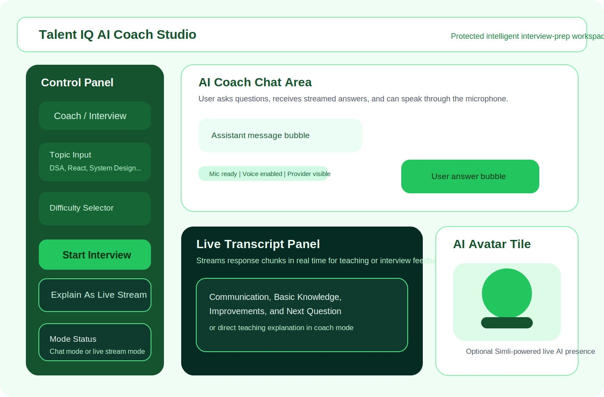
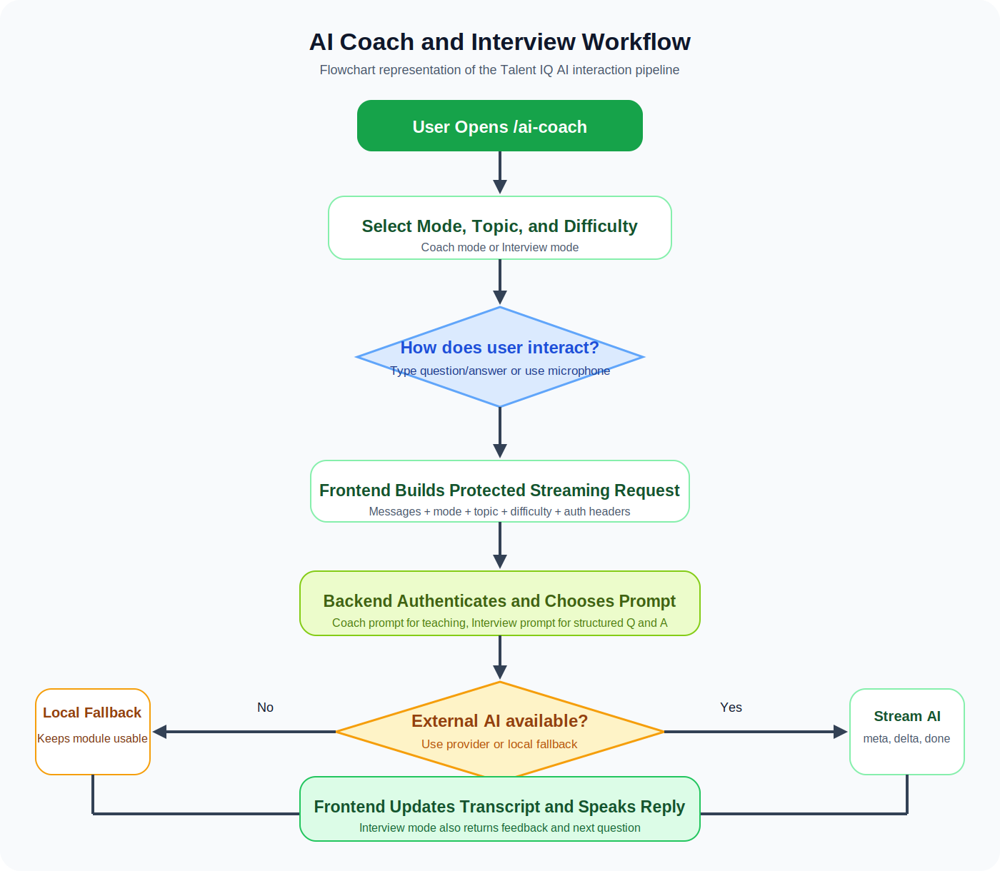
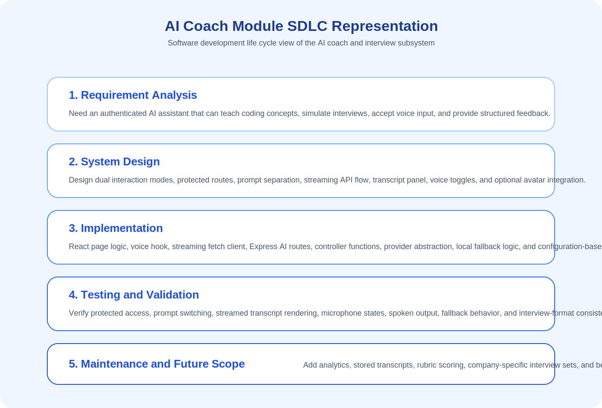
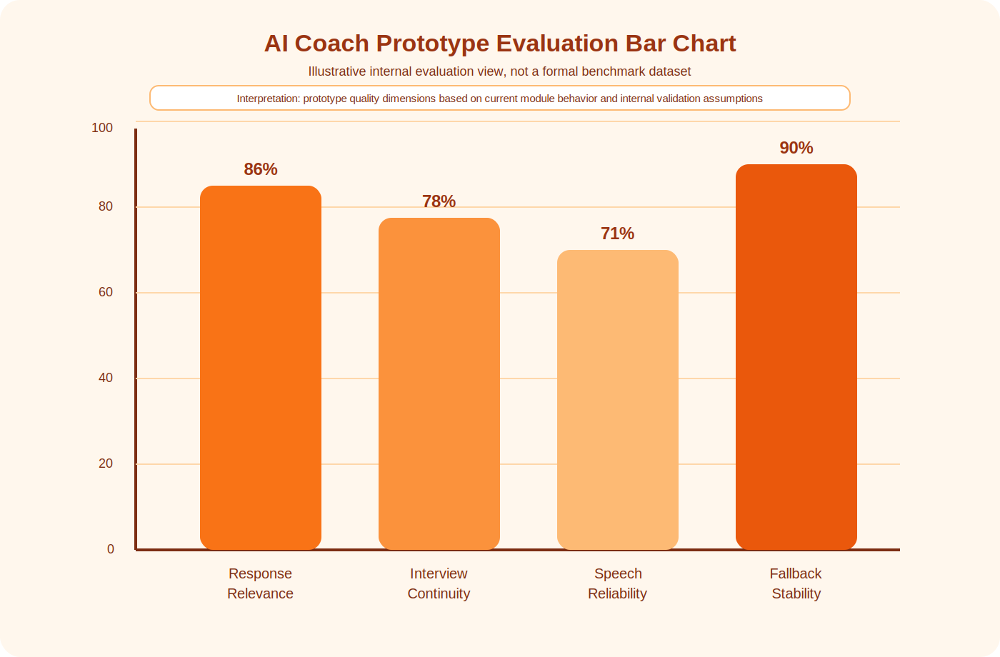

# Chapter 5: AI Coach, AI Interview Workflow, SDLC Representation, and Accuracy View

## 5.1 Introduction

The AI Coach module is one of the most distinctive and modern parts of the Talent IQ platform. While the Problems module helps users practice coding independently and the Dashboard helps them navigate collaborative activity, the AI Coach brings guided intelligence into the learning process. It acts as a digital companion that can teach, question, listen, respond, and simulate an interview-oriented communication flow.

In educational terms, this module is important because technical interview preparation is not limited to solving code correctly. A candidate must also explain ideas clearly, answer in a structured manner, react to follow-up questions, and stay confident during a live interaction. The AI Coach module addresses this need by combining AI-generated responses, streaming interaction, speech support, and interview-mode feedback inside one protected application flow.

The current implementation provides two core experiences:

- `Coach mode`, which behaves like a teaching assistant and explains coding or interview concepts directly
- `Interview mode`, which behaves like an interviewer and asks one question at a time, then gives structured feedback

This chapter explains the AI Coach module in a detailed and report-ready format. It covers the purpose of the coach, the interview workflow, frontend and backend operation, streaming design, speech features, avatar integration, SDLC representation, flowchart explanation, and a bar-chart-style view of prototype AI accuracy. The goal is to present the module in a clear and elaborate manner suitable for academic documentation, viva preparation, and final report submission.

## 5.2 Role of the AI Coach in Talent IQ

The AI Coach is not just an additional chatbot page. It is a guided preparation environment designed to improve the user in three important dimensions:

1. conceptual understanding
2. communication ability
3. interview readiness

When a learner studies programming, there is often a gap between knowing a topic and explaining that topic clearly. The AI Coach reduces that gap. In Coach mode, the user can ask for explanations about arrays, trees, React, system design, time complexity, or interview strategy. The AI responds with a teaching-oriented explanation. In Interview mode, the same system changes behavior and begins asking the user interview questions. It then evaluates the answer using a structured feedback format.

This makes the module valuable because it supports both:

- knowledge acquisition
- performance rehearsal

From a platform perspective, the AI Coach connects the learning philosophy of Talent IQ with current industry expectations. Modern interview preparation is increasingly conversational, adaptive, and AI-assisted. Therefore, the AI Coach module gives Talent IQ a more realistic and future-facing identity than a traditional static preparation system.

## 5.3 Main Objectives of the AI Coach Module

The AI Coach module is designed with the following objectives:

- to provide personalized and interactive guidance for coding interview preparation
- to allow users to ask topic-specific questions in a natural language interface
- to simulate mock interviews in a structured question-and-answer pattern
- to support live transcript-style streaming so the answer feels dynamic and immediate
- to support speech input when browser-based speech recognition is available
- to support spoken AI replies through browser speech synthesis
- to optionally present the AI through a video avatar session
- to keep the feature protected so only authenticated users can access it

These objectives are important because interview preparation is a multi-layered skill. A learner must think, speak, justify, and reflect. The AI Coach module is therefore built as a practical rehearsal system rather than a simple response generator.

## 5.4 Protected Access and Entry into the Module

The AI Coach page is available through the route `/ai-coach`. In the application routing structure, this page is wrapped by the same authentication protection used for major user features. If the user is not signed in, the route redirects them through the protected access mechanism instead of exposing the AI experience publicly.

This protected design has multiple advantages:

- user activity is tied to an authenticated identity
- AI endpoints are not exposed as anonymous public APIs
- future progress history can be associated with a real account
- the module stays aligned with the platform's secure workflow

From a documentation point of view, this means the AI Coach is not a disconnected demo page. It is a formal, authenticated subsystem within the Talent IQ architecture.

## 5.5 Major Functional Areas of the AI Coach Page

The AI Coach page contains several coordinated functional parts:

- mode switcher between Coach and Interview
- topic input field
- difficulty selector
- text-based chat area
- microphone-driven voice input support
- live streaming transcript panel
- browser voice output
- optional AI avatar tile
- provider and model visibility
- fallback handling when external AI quota is unavailable

These parts work together to create a more complete experience than a normal text chatbot. The page supports both classic text interaction and richer conversational presentation. The design also allows the user to move from silent reading to speech-based rehearsal, which is especially useful in interview preparation.

## 5.6 Coach Mode Explained

Coach mode is the teaching-oriented mode of the system. In this mode, the AI behaves like a tutor or assistant instead of like an interviewer. The system prompt used by the backend instructs the model to answer the exact user question directly, explain concepts clearly, provide short examples, and avoid turning the conversation into a quiz unless the user explicitly requests it.

This mode is useful for:

- learning data structures and algorithms
- revising computer science fundamentals
- asking for short coding examples
- understanding time and space complexity
- clarifying interview-related concepts
- receiving practical solving advice

For example, a user might ask:

- "Explain binary search with one example."
- "What is the difference between BFS and DFS?"
- "How do I answer React state questions in an interview?"

In response, the AI Coach is expected to reply in a direct and teaching-focused style. This is important because learners often need clarity before they need assessment. Coach mode therefore supports preparation before simulation.

## 5.7 Interview Mode Explained

Interview mode changes the personality and structure of the AI. Instead of explaining the answer immediately, the system behaves like a mock interviewer. The backend prompt explicitly instructs the model to ask one question at a time, wait for the candidate's response, and then return feedback using fixed headings:

- `Communication`
- `Basic Knowledge`
- `Improvements`
- `Next Question`

This structure is valuable because it turns the interaction into a repeatable interview loop. The user answers a question. The AI comments on how clearly the answer was delivered, whether the core technical understanding is visible, and what can be improved immediately. Then it asks exactly one new question.

This mode is especially useful because technical interviews are not judged only on correctness. Interviewers also observe:

- clarity of explanation
- confidence and structure
- ability to justify decisions
- awareness of edge cases and trade-offs
- continuity across follow-up questions

The current implementation reflects these realities in a lightweight but academically meaningful way.

## 5.8 Workflow of the AI Coach Module

The overall workflow of the AI Coach module can be described as follows:

1. The authenticated user opens the AI Coach page.
2. The page initializes with a default assistant introduction message.
3. The user selects a mode: Coach or Interview.
4. The user chooses a topic and difficulty.
5. The user enters text manually or uses voice input.
6. The frontend sends the conversation state to the streaming AI endpoint.
7. The backend builds the correct system prompt based on the selected mode.
8. The AI response is streamed back in chunks.
9. The frontend updates the transcript and message view live.
10. The browser optionally speaks the response aloud.
11. In Interview mode, the user receives structured feedback and the next question.
12. If configured, the avatar tile visually represents the AI as a live participant.

This workflow is important because it combines interaction design, AI orchestration, and user-facing feedback into one guided sequence.

## 5.9 Detailed Coach Workflow

The Coach workflow begins when the page loads in its default teaching mode. The user can immediately type a question in the text area. A send action creates a new user message, inserts an empty assistant placeholder, and starts a streaming request.

The frontend then performs the following tasks:

- prevents duplicate prompt submission using a request key
- aborts any older in-progress stream
- stores the latest user message in the conversation history
- clears the input box
- opens the live transcript when needed
- tracks the provider and model used for the reply

At the backend, the request reaches the protected AI route. The route passes the message list, topic, difficulty, and mode into the AI client. The AI client sanitizes the message history, builds the system prompt, and then attempts the configured provider flow. When the reply begins to stream, the backend writes newline-delimited JSON events back to the client.

The frontend reads these events one by one. Delta chunks are appended to the transcript and simultaneously inserted into the latest assistant message. This gives the user a live, continuous response rather than a delayed final block.

When the final event arrives:

- the transcript is completed
- provider and model names are shown
- the message is spoken aloud if voice output is enabled
- the sending state is cleared

This is a good example of responsive AI UI design because it keeps the user visually engaged throughout the answer generation process.

## 5.10 Detailed Interview Workflow

Interview mode begins in one of two ways:

- the user manually switches to Interview mode and presses `Start Interview`
- the user types an interview-start message in the chat area

When interview mode is activated, the page resets the message state to an interview-specific introduction. The `Start Interview` action then sends a command instructing the AI to begin a mock interview on the selected topic and difficulty. The backend prompt for interview mode tells the model to return only the first interview question when the session starts.

After that, the interaction becomes cyclical:

1. the AI asks one interview question
2. the user answers
3. the backend generates feedback under fixed headings
4. the frontend shows that feedback in the transcript and message history
5. the AI asks the next question

This design is strong because it creates structure. Without a structure, AI interviews may become too broad, inconsistent, or tutor-like. By forcing the response to include `Communication`, `Basic Knowledge`, `Improvements`, and `Next Question`, the project keeps the experience aligned with interview simulation rather than drifting into casual conversation.

The page also includes an encouragement mechanism. When the user gives a sufficiently detailed answer and the feedback appears positive, the interface may display a short appreciation message. This small UX detail is useful because mock interviews can feel intimidating. Positive reinforcement helps sustain motivation.

## 5.11 Speech Input and Microphone Workflow

The AI Coach module supports voice input through the `useSpeechInput` hook. This hook first checks whether browser speech recognition is available. When supported, the system uses live recognition through browser APIs. When that is not possible, the hook contains a recorded-audio fallback structure, although the current AI Coach page disables the recorded fallback in this setup.

The speech workflow includes the following stages:

1. microphone permission is requested
2. browser speech recognition starts listening
3. interim and final transcript text fills the input box
4. the user can stop listening or send the transcribed message

If browser speech recognition is unavailable or microphone access is blocked, the system reports a friendly error message. This is important for usability because voice features can fail for environmental reasons such as browser incompatibility, insecure origin, missing permission, or unsupported devices.

The speech design is useful for interview rehearsal. Many candidates can think of an answer but struggle to speak it fluently. Voice input encourages spoken practice, which is closer to real interview behavior than silent typing alone.

## 5.12 AI Voice Output and Live Explanation

After the AI response is completed, the page can use browser speech synthesis to speak the answer aloud. This creates a more natural coach-like or interviewer-like presence. The user can enable or disable voice output with a button. When disabled, the transcript still appears visually.

This feature offers three practical advantages:

- it makes the AI feel conversational rather than static
- it helps the user absorb explanations in audio form
- it improves the mock interview atmosphere

The page also supports a `live stream` presentation mode. In this layout, the avatar tile becomes prominent, the live transcript area is highlighted, and the chat panel becomes optional. This is a useful design choice because it separates two styles of usage:

- text-first study interaction
- stream-first guided speaking experience

## 5.13 AI Avatar Integration

The Talent IQ project includes optional AI avatar integration through the `SimliAvatarTile` component. This component requests an avatar session token from the backend and, when the required environment variables are present, starts a real-time avatar session using the external client.

The avatar integration works as follows:

1. the frontend mounts the avatar tile
2. it requests a session token from `/api/ai/avatar/session`
3. the backend checks `SIMLI_API_KEY` and `SIMLI_FACE_ID`
4. if valid, the backend requests a new session token from the external avatar service
5. the frontend starts the avatar client and connects video and audio elements

If the avatar is not configured, the component does not crash the page. Instead, it shows a fallback visual state and a helpful configuration message. This is a good example of graceful degradation. The AI Coach module can still work fully in text and voice mode even when the avatar service is unavailable.

From a report perspective, the avatar feature is important because it shows that Talent IQ is capable of moving beyond text interaction into a more embodied AI experience.

## 5.14 Backend Processing and Prompt Engineering

The backend AI client is central to the intelligence of the module. It performs several key responsibilities:

- selecting prompt behavior based on mode
- sanitizing messages to limit noise and excessive payload size
- choosing a configured AI provider
- streaming responses back to the frontend
- falling back to local behavior when external quota is unavailable

The prompt design is one of the most important technical details in this module. The project uses different system prompts for different contexts:

- `coach` prompt for direct teaching and explanation
- `interview` prompt for structured mock interview sequencing
- `resume` prompt for the resume checker workflow

In interview mode, the system prompt strongly constrains response format. This increases reliability because the frontend can expect predictable sections. In coach mode, the prompt instead emphasizes direct explanation and short examples. This separation is a good software design choice because one AI personality is not suitable for all educational tasks.

## 5.15 Streaming Architecture

One of the strongest implementation details of the AI Coach module is its streaming architecture. Rather than waiting for a full response and then rendering it all at once, the frontend requests `/api/ai/coach/stream`. The backend replies using newline-delimited JSON events. These events include:

- `meta` events for provider and model information
- `delta` events for text chunks
- `done` events for the final reply
- `error` events when something fails

This architecture improves the user experience in several ways:

- perceived latency is reduced
- the interface feels more alive and conversational
- the transcript can update in real time
- the same pattern supports both chat and live-stream presentation

From a software engineering perspective, this is a modern event-streaming design that cleanly separates incremental response delivery from final completion handling.

## 5.16 Authentication, Validation, and Reliability

The AI routes in the backend are protected by middleware. This middleware ensures that only valid signed-in users can call the AI APIs. On the frontend side, auth headers are added when requests are made. This is important because AI endpoints can otherwise be misused, overloaded, or detached from user context.

The module also contains several validation and reliability checks:

- empty messages are not sent
- duplicate requests are blocked
- previous streams can be aborted cleanly
- voice errors are surfaced with readable explanations
- avatar configuration failures are handled gracefully
- resume upload limits and file-type validation exist in related AI routes

These design choices are important because a polished AI feature depends not only on model intelligence but also on safe and stable request handling.

## 5.17 Flowchart Representation of the AI Coach

The AI Coach flowchart can be understood in three major stages:

### Stage 1: Input Preparation

In this stage, the user chooses mode, topic, and difficulty, then enters a question or answer by typing or speaking. The frontend prepares the message list and sends a protected request.

### Stage 2: AI Processing

In this stage, the backend authenticates the request, selects the prompt type, sanitizes the conversation, chooses the provider, and streams the generated response.

### Stage 3: User Feedback Loop

In this stage, the frontend updates the transcript, stores the response, optionally speaks it aloud, and continues the interaction. In interview mode, the loop repeats with the next question.

The flowchart representation is useful because it shows that the AI Coach is not a single action. It is an interaction loop built from input capture, AI processing, and response presentation.

## 5.18 SDLC Representation of the AI Coach Module

The AI Coach module can also be described using an SDLC-based academic view:

### Requirement Analysis

The system needs a guided interview-preparation tool that can both teach concepts and simulate interviews. It must be interactive, secure, and suitable for authenticated users.

### System Design

The page is designed around dual modes, streaming interaction, voice capability, and optional visual avatar presence. Backend AI routes, prompt separation, and protected access are defined at this stage.

### Implementation

React is used for the page UI, message state, transcript rendering, mode switching, and voice toggles. Express routes and controllers handle AI streaming, transcription, and avatar token generation. Clerk-based authentication protects the workflow.

### Testing and Validation

The implementation is validated by checking routing protection, stream behavior, transcript updates, voice input states, interview feedback format, fallback behavior, and avatar error handling.

### Maintenance and Enhancement

The module can be extended with conversation history storage, analytics, rubric scoring, topic recommendation, multi-round interview reports, and real benchmark evaluation.

This SDLC representation is valuable because it transforms the module from a page-level feature into a complete software-engineering artifact.

## 5.19 AI Accuracy Representation

In academic reports, AI modules are often expected to include some representation of performance. However, it is important to remain honest about what the current repository actually contains. The present project includes live functionality and structured prompting, but it does not yet include a formal benchmark dataset, confusion matrix, or logged evaluation study.

Therefore, the accuracy chart provided in this chapter should be understood as a **prototype evaluation representation** based on current functional behavior, prompt structure, and expected internal validation goals, not as a published scientific benchmark.

The chart uses four practical quality dimensions:

- response relevance
- interview flow consistency
- speech input reliability
- fallback stability

These are meaningful for this module because the AI Coach is not only about factual correctness. Its usefulness also depends on whether it stays in the correct mode, maintains a question-answer structure, captures speech sensibly, and continues to operate when external AI access is limited.

For report writing, this representation is acceptable as long as it is described clearly as a prototype or internal evaluation view. If the project is later tested with real users, these bars should be replaced by experimental results.

## 5.20 Academic Interpretation of the Accuracy Bars

The bar chart in this chapter represents the following interpretation:

- `Response Relevance` reflects how well the answer stays aligned with the user's topic and difficulty.
- `Interview Continuity` reflects whether the AI consistently asks one question at a time and gives structured feedback.
- `Speech Reliability` reflects practical microphone and browser recognition behavior in supported environments.
- `Fallback Stability` reflects whether the module continues functioning through local fallback when external quota is unavailable.

This kind of representation is helpful in project reports because it communicates that AI system quality is multi-dimensional. In educational software, "accuracy" is not only about one numerical score. It also includes continuity, usability, consistency, and robustness.

## 5.21 Technologies Used in the AI Coach Module

The AI Coach module is built using multiple integrated technologies:

### Frontend Technologies

- React for page structure and component logic
- React Router for protected route access
- React Hot Toast for user feedback messages
- Lucide React for icons
- browser Speech Recognition APIs for live voice input
- browser Speech Synthesis for spoken AI replies

### Backend Technologies

- Node.js and Express for API routing
- protected route middleware for access control
- AI controller functions for streaming, transcription, and avatar token generation
- provider abstraction inside `aiClient.js`

### AI and External Service Layer

- OpenAI-compatible API usage for transcription when configured
- Gemini or OpenAI model support in the AI client when configured
- Ollama support for local model fallback
- Simli session support for AI avatar video presence

The combination of these technologies makes the module a strong example of applied full-stack AI integration.

## 5.22 Educational and Practical Importance

The AI Coach module adds educational depth to Talent IQ in several ways:

- it converts passive reading into active dialogue
- it supports communication practice, not only code logic
- it gives immediate guidance without requiring a human mentor every time
- it helps learners prepare for pressure-based technical interaction
- it connects concept learning with mock interview rehearsal

In practical terms, the module is valuable because students often lack access to frequent mock interviews. An AI interviewer cannot fully replace a human interviewer, but it can provide repetition, confidence building, and structured practice at any time.

## 5.23 Limitations of the Current Module

Although the module is strong in design and educational usefulness, some limitations remain:

- there is no long-term conversation history persistence yet
- the current project does not include a formal benchmark dataset for AI quality
- speech features depend on browser support and permission availability
- avatar presence depends on external configuration
- interview evaluation is prompt-based and heuristic rather than rubric-scored with stored analytics

These limitations do not reduce the importance of the module, but they should be stated clearly for academic honesty and future development planning.

## 5.24 Future Enhancements

The AI Coach module can be improved further through:

- stored interview transcripts and progress reports
- question banks by company or topic
- rubric-based scoring for communication and correctness
- analytics dashboards for improvement over time
- multi-round interview sessions with summary reports
- richer speech fallback support
- sentiment and confidence tracking
- more formal evaluation graphs using real user test data

These enhancements would strengthen both the academic value and the practical competitiveness of the project.

## 5.25 Figures for This Chapter

Figure 5.1: AI Coach module overview

Figure 5.2: AI Coach and Interview workflow flowchart

Figure 5.3: SDLC representation of the AI Coach module

Figure 5.4: Prototype AI accuracy bar chart

## 5.26 Chapter Summary

The AI Coach module is one of the most advanced and human-centered features in Talent IQ. It introduces an intelligent, interactive layer that helps users learn concepts, practice communication, and rehearse interview behavior. Through its two-mode design, the module supports both tutoring and simulation. Through streaming, speech support, and optional avatar presence, it creates a modern conversational experience. Through protected routing and backend orchestration, it remains a formal part of the secure application architecture.

From a software engineering perspective, this chapter shows that the AI Coach module is not merely a UI screen. It is a complete subsystem involving prompt design, event streaming, voice handling, route protection, fallback logic, and user-centered workflow design. From an academic perspective, it strengthens the overall Talent IQ project by showing how AI can be integrated responsibly into interview preparation and guided learning environments.
