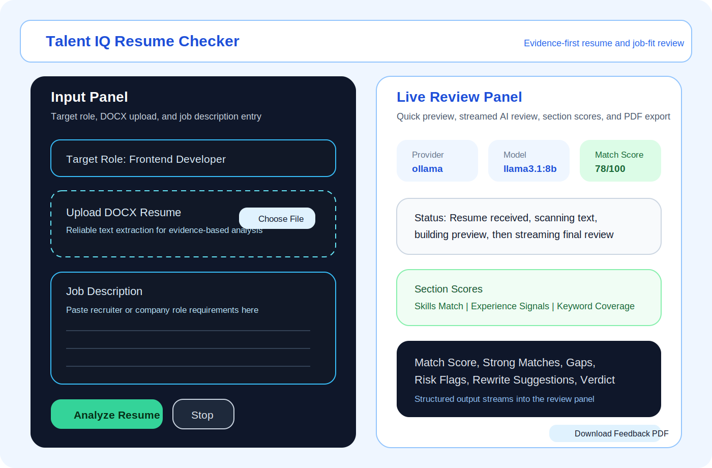
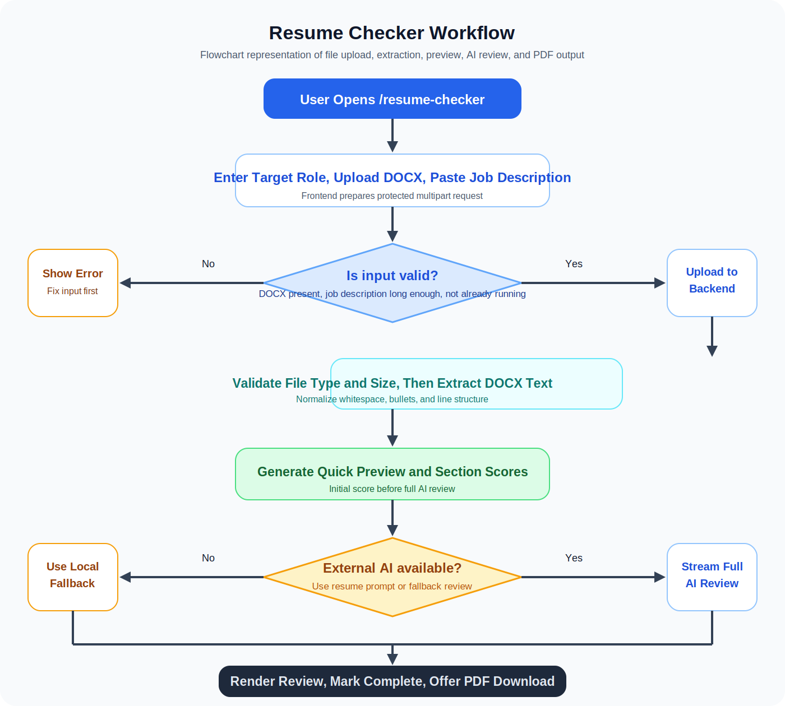
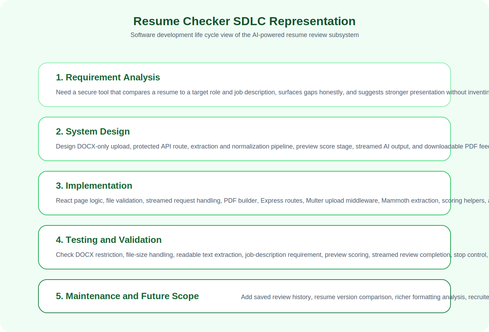
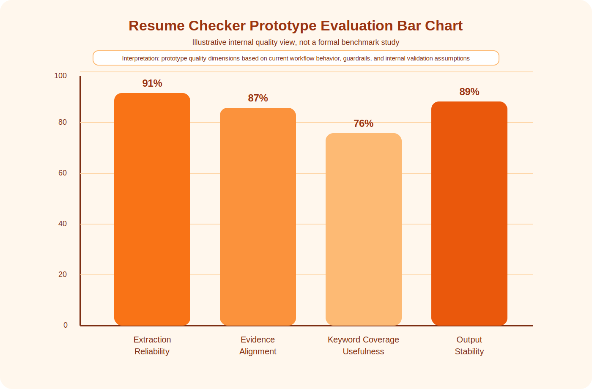

# Chapter 6: Resume Checker Workflow, AI Review Methodology, SDLC Representation, and Evaluation View

## 6.1 Introduction

The Resume Checker module is one of the most practical AI-assisted features in the Talent IQ platform. While the Problems Page supports coding practice and the AI Coach supports concept explanation and mock interview conversation, the Resume Checker focuses on another critical part of interview preparation: presenting skills and experience in a clear, evidence-based, and role-aligned resume.

In real placement and recruitment environments, a candidate may have good technical ability but still fail to progress because the resume does not communicate that ability effectively. Important skills may be buried, achievements may be written vaguely, role alignment may be weak, and job-description keywords may be missing or unsupported. The Resume Checker is designed to address this problem by comparing an uploaded resume against a target role and job description, then generating structured AI feedback.

This chapter explains the Resume Checker module in a clear and elaborate academic manner. It covers the purpose of the module, page workflow, file handling, backend scanning pipeline, quick preview generation, full AI review logic, relationship with the broader AI subsystem, SDLC representation, flowchart representation, and a bar-chart-style evaluation view. The chapter is intended to be detailed enough for approximately nine pages of report matter in standard academic formatting.

## 6.2 Role of the Resume Checker in Talent IQ

The Resume Checker plays a different but equally important role compared to the AI Coach and AI Interview modules described earlier. The AI Coach focuses on explanation and interview rehearsal. The Resume Checker focuses on representation and application readiness. Together, these features form a larger preparation ecosystem:

- the Problems module improves solving ability
- the AI Coach improves conceptual understanding
- the Interview mode improves spoken interview performance
- the Resume Checker improves written professional representation

This relationship is important because interview success depends on more than coding skill alone. A learner must:

- solve problems
- explain decisions
- present skills honestly and effectively
- align experience with job expectations

The Resume Checker therefore extends the Talent IQ platform from coding practice into employability preparation. It acts as a bridge between technical learning and professional application.

## 6.3 Main Objectives of the Resume Checker Module

The Resume Checker module is designed with the following objectives:

- to compare resume content against a pasted job description
- to evaluate role alignment using evidence from the uploaded resume
- to identify strong matches and missing requirements
- to highlight weak presentation, vague claims, and unsupported wording
- to provide role-specific rewrite suggestions
- to avoid inventing projects, metrics, tools, or achievements
- to stream feedback live so the user can see progress in real time
- to export the generated feedback as a PDF document

These objectives are especially important in modern hiring contexts where automated screening, recruiter scanning, and quick judgment are common. A resume must be both technically relevant and clearly represented.

## 6.4 Relationship with the AI Coach and Interview Modules

Although the Resume Checker is a separate page, it is not isolated from the rest of the AI architecture. It uses the same broader AI backend infrastructure as the AI Coach and Interview pages. In other words, Talent IQ does not implement three unrelated AI systems. Instead, it uses a shared AI foundation with different mode-specific behaviors.

The relationship can be understood as follows:

- `coach mode` teaches concepts directly
- `interview mode` asks questions and returns communication-oriented feedback
- `resume mode` analyzes representation quality and job alignment

This shared design is visible in the backend AI client, where the system prompt changes according to the selected `mode`. This is an important software engineering decision because it allows one infrastructure layer to support multiple user-facing AI workflows while preserving distinct task behavior.

From a documentation perspective, Chapter 6 therefore complements Chapter 5. Chapter 5 explains the conversational AI subsystem through Coach and Interview mode. Chapter 6 explains how the same intelligent foundation is extended into evidence-based document review.

## 6.5 Protected Access and Entry into the Module

The Resume Checker page is available through the route `/resume-checker`. Like the AI Coach page, it is placed behind frontend route protection and backend API protection. Only authenticated users can access the page and call the related analysis endpoint.

This secure entry model is important for several reasons:

- the uploaded resume is personal data
- the AI processing should not be publicly exposed without identity control
- future stored analysis history can remain user-specific
- the module remains consistent with the protected architecture of Talent IQ

The backend route for streaming resume analysis is also guarded by authentication middleware. This ensures that the module is not simply a public upload tool but a secure subsystem of the application.

## 6.6 Major Functional Areas of the Resume Checker Page

The Resume Checker page contains several clearly defined functional sections:

- hero section explaining purpose and limitations
- provider, model, and score summary cards
- input area for target role
- file upload area for DOCX resume input
- job description text area
- analyze and stop actions
- live status messaging
- streamed review output panel
- section score summary cards
- feedback PDF download action

These sections are designed to guide the user through a structured review workflow. The page is not a plain upload form. It is a guided review environment that communicates progress, constraints, and interpretation clearly.

## 6.7 Why DOCX Is Used Instead of PDF

One of the most important implementation choices in this module is that the uploaded resume must be a DOCX file. This choice is not arbitrary. It reflects a practical data-extraction decision.

PDF resumes can be difficult to parse reliably because:

- text order may be inconsistent
- columns may be read incorrectly
- icons and styling may break extraction quality
- hidden formatting can distort sentence flow

DOCX files provide more reliable text extraction for the current backend implementation. The page therefore explicitly communicates that DOCX is the supported format for reliable scanning. This is a strong design choice because it reduces misleading analysis caused by poor file extraction.

From an academic standpoint, this also demonstrates an important software engineering principle: input constraints should be chosen to improve accuracy and reliability rather than simply maximize file-format flexibility.

## 6.8 High-Level Workflow of the Resume Checker

The end-to-end workflow of the Resume Checker module can be summarized as follows:

1. The authenticated user opens the Resume Checker page.
2. The user enters a target role.
3. The user uploads a DOCX resume file from local storage.
4. The user pastes a relevant job description.
5. The user presses `Analyze Resume`.
6. The frontend sends a protected multipart request to the backend.
7. The backend validates the file type and file size.
8. The backend extracts readable text from the DOCX file.
9. The backend generates a quick preview score and section scores.
10. The backend starts full AI analysis in `resume` mode.
11. The analysis is streamed back to the frontend in real time.
12. The frontend shows live output, score, provider, and readiness state.
13. The user can optionally download the final feedback as a PDF.

This workflow is important because it shows that the Resume Checker is not a single AI call. It is a multi-stage pipeline involving file upload, text extraction, preview generation, AI reasoning, and user-facing document output.

## 6.9 Frontend Input Workflow in Detail

The input side of the Resume Checker begins with three main inputs:

- target role
- resume file
- job description

The `target role` helps the system frame the review in a role-specific way. For example, the same resume might be reviewed differently for a `Frontend Developer` role and for a `Data Analyst` role. This makes the feedback more focused.

The `resume file` must be DOCX. When the user selects a file, the page checks the MIME type or filename extension. If the file is not DOCX, the page rejects it and shows a toast error. This prevents invalid analysis early.

The `job description` acts as the comparison target. The system expects the job description to be meaningfully detailed. The page only enables strong analysis when the pasted description has sufficient length. This is useful because resume fit analysis without a real job description would be weak, vague, and less trustworthy.

The page then calculates whether analysis can begin:

- a resume file must exist
- the job description must be long enough
- the system must not already be analyzing

This validation supports clearer user experience and reduces unnecessary backend calls.

## 6.10 Upload and Request Handling Workflow

When the user starts analysis, the frontend constructs a multipart form request through the AI API layer. This request contains:

- the uploaded resume file
- the job description text
- the optional target role

An abort controller is created before the request begins. This allows the in-progress analysis to be stopped cleanly if the user presses the `Stop` button or starts a new analysis. This is an important UI behavior because AI and document processing can take time, and the user should remain in control.

At the beginning of analysis, the page resets several states:

- previous analysis text is cleared
- live score is cleared
- section scores are cleared
- feedback readiness is set to false
- provider is set to a connecting state
- model is reset
- status text is updated to indicate upload and scan preparation

This makes the workflow feel clean, deliberate, and easy to understand.

## 6.11 Backend Validation Workflow

The backend route for resume analysis uses upload middleware with in-memory storage. It applies important constraints:

- only one resume file is accepted
- the file size is limited to 5 MB
- the file must be DOCX

If the file is too large, the backend returns a specific error. If the file is of the wrong type, the backend returns a message asking for a valid DOCX resume file. This explicit validation is important because file handling is one of the highest-risk parts of any upload-based module.

From a software engineering perspective, this shows that the Resume Checker is designed with defensive validation rather than assuming all user input is valid.

## 6.12 Resume Text Extraction Workflow

After validation, the backend begins text extraction from the DOCX file. This is handled using a DOCX parsing library and a normalization pipeline. The extracted content is cleaned and normalized in several ways:

- null characters are removed
- unusual bullet characters are normalized
- excessive whitespace is compacted
- broken lines are merged when appropriate
- empty lines are filtered

This normalization stage is extremely important. AI review quality depends directly on the quality of the extracted text. If the raw extraction is messy, the resulting review may become unreliable. By normalizing the resume text before analysis, the system improves readability and helps the AI work with cleaner content.

The controller also maintains a small cache of extracted resume text. If the same file is analyzed again, the system can reuse cached text and start faster. This is a practical optimization that improves responsiveness without changing the analysis outcome.

## 6.13 Quick Preview Workflow

One of the most user-friendly design choices in the Resume Checker is the quick preview stage. Before the full AI review is streamed, the backend computes an immediate preliminary result using lightweight keyword and signal analysis.

This quick preview includes:

- an initial match score
- section scores for skills, experience signals, and keyword coverage
- strong-match indicators
- visible gaps
- early rewrite direction

The purpose of the quick preview is not to replace the full AI review. Instead, it reduces waiting uncertainty and gives the user an early sense of where the resume stands.

This stage analyzes:

- keyword overlap between the resume and job description
- presence of known skill terms
- evidence of bullet points
- measurable outcomes such as percentages, counts, years, or quantified results

The quick preview is therefore a useful hybrid step between raw upload and full AI interpretation.

## 6.14 Full AI Review Workflow

After the quick preview is generated, the backend starts the full AI review using `resume` mode in the shared AI client. In this mode, the system prompt is very different from the coaching or interview prompt. It instructs the AI to behave as a careful resume reviewer and job-fit analyst.

The prompt emphasizes several guardrails:

- be conservative and evidence-based
- only use information present in the resume and job description
- do not invent tools, employers, dates, certifications, metrics, or projects
- point out when evidence is missing
- focus on representation quality, clarity, keyword coverage, and practical improvement

The expected structured output includes the following headings:

- `Match Score`
- `Strong Matches`
- `Gaps`
- `Risk Flags`
- `Rewrite Suggestions`
- `Verdict`

This structure is significant because it makes the output easier to read, easier to explain in a report, and easier for the user to act upon.

## 6.15 Streaming Output Workflow

Like the AI Coach page, the Resume Checker uses streaming output rather than waiting for one complete AI response. The backend sends newline-delimited JSON events. The frontend processes these events as they arrive.

Important event types include:

- `status` for stage updates such as upload received and scan starting
- `preview` for the quick preliminary result
- `meta` for provider and model identification
- `delta` for streamed chunks of the full review
- `done` for the final completed answer

This event-driven architecture improves the experience in several ways:

- the user sees progress immediately
- the waiting period feels transparent
- the page can show quick preview and final review separately
- the interface feels live and responsive

From a software engineering perspective, this is one of the strongest parts of the implementation because it separates process visibility from final content delivery.

## 6.16 Score Representation in the UI

The Resume Checker page displays both an overall score and section-level scores. These scores help the user understand that resume quality is multi-dimensional rather than binary.

The UI can present:

- overall match score
- skills match score
- experience signals score
- keyword coverage score

This is useful because two resumes may have the same overall impression but differ in why they are strong or weak. One may contain the right keywords but poor measurable evidence. Another may show strong experience signals but weak alignment to the specific role. The section scores make these differences visible.

It is also important to state clearly that these scores are advisory and heuristic. They are not official hiring scores, recruiter scores, or ATS certainties.

## 6.17 Accuracy Guardrails and Evidence-First Design

One of the most important academic and ethical strengths of the Resume Checker is its evidence-first design. The page itself explicitly communicates an accuracy guardrail: it should not invent projects, metrics, tools, or experience. If something is not supported by the uploaded resume, the analysis should say so instead of pretending otherwise.

This principle appears in multiple layers:

- frontend explanation cards
- backend prompt instructions
- local fallback behavior
- structured output expectations

This design is especially important for resume-related AI features. Overconfident or fabricated advice can be harmful because users may insert false or unsupported claims into professional documents. By making the system conservative, the project reduces that risk.

## 6.18 Local Fallback and Reliability

The shared AI infrastructure also supports local fallback behavior. If external AI availability is limited, the system can still produce a simpler resume review using local keyword and structure analysis. This local fallback is not as rich as full model output, but it helps keep the module usable.

The local fallback can still provide:

- a basic match score
- keyword overlap interpretation
- missing requirement indicators
- rewrite direction
- a cautious verdict

This is an important reliability feature because AI modules should degrade gracefully rather than fail completely whenever an external provider becomes unavailable.

## 6.19 PDF Feedback Generation Workflow

Another strong feature of the Resume Checker is the ability to export the final feedback as a PDF. Once the analysis is complete, the frontend can generate a PDF document using the visible analysis text and score information.

The generated PDF includes:

- report heading
- target role
- resume filename
- match score
- section scores
- the full structured review text

The PDF builder wraps lines, escapes text safely, paginates the content, constructs PDF objects manually, and returns a downloadable blob. This is technically interesting because it shows the project going beyond simple on-screen AI output and into document generation.

From a user perspective, this is useful because the feedback can be stored, shared, compared between resume versions, or attached to a project demonstration.

## 6.20 Flowchart Representation of the Resume Checker

The Resume Checker flow can be understood through three main stages:

### Stage 1: Input and Validation

The user enters target role, uploads a DOCX file, and pastes the job description. The frontend checks whether the input is sufficient to begin analysis.

### Stage 2: Backend Scan and AI Review

The backend validates the file, extracts resume text, normalizes it, generates a quick preview, and then begins full AI review using the resume-analysis prompt.

### Stage 3: Output and Action

The frontend displays streamed review text, updates scores, marks the analysis as ready, and lets the user download a PDF report.

This flowchart representation is useful because it shows that the module is an organized review pipeline rather than a single opaque AI call.

## 6.21 SDLC Representation of the Resume Checker Module

The Resume Checker module can be explained using an SDLC-style academic perspective:

### Requirement Analysis

The system requires a tool that can analyze resume-job alignment, surface evidence-backed matches and gaps, and help users improve professional representation before applying for a role.

### System Design

The design stage defines protected access, DOCX input, streamed status messaging, preview scores, structured AI output, and downloadable PDF feedback.

### Implementation

React implements the user interface, input handling, status display, and PDF generation. Express and middleware handle file upload, validation, extraction, and streaming review. The shared AI client provides prompt-based behavior for resume analysis.

### Testing and Validation

The module should be validated for correct file-type rejection, size-limit handling, extraction success, missing job-description behavior, preview rendering, streamed feedback, stop-action behavior, and PDF download correctness.

### Maintenance and Future Scope

The module can be improved with version comparison, saved review history, richer formatting insights, recruiter-specific scorecards, and real benchmark evaluation using user studies.

This SDLC representation shows that the Resume Checker is a full subsystem with its own requirements, architecture, implementation, and maintainability path.

## 6.22 Practical Interpretation of AI Quality in Resume Checking

As with the AI Coach chapter, it is important to be careful and honest when representing AI quality. The current repository contains a working Resume Checker with prompt guardrails, preview scoring, and streamed feedback. However, it does not yet contain a formal benchmark dataset or a large experimental evaluation study.

Therefore, any accuracy graph or bar chart in this chapter should be described as a **prototype evaluation representation** or **internal quality view**, not as a verified scientific benchmark. This protects the report from making inflated claims.

For this module, useful quality dimensions include:

- extraction reliability
- evidence alignment
- keyword coverage usefulness
- output stability

These dimensions are more meaningful here than a single generic accuracy number because resume checking is partly interpretive and depends on extraction quality, prompt discipline, and practical usability.

## 6.23 Interpretation of the Evaluation Bars

The prototype evaluation bars in this chapter can be interpreted as follows:

- `Extraction Reliability` reflects how dependably the system extracts usable DOCX text.
- `Evidence Alignment` reflects how consistently the output stays grounded in the uploaded resume instead of inventing unsupported claims.
- `Keyword Coverage Usefulness` reflects how well the system surfaces relevant overlap and missing role terms.
- `Output Stability` reflects whether the review remains available through preview logic, fallback support, and streamed completion.

This multi-dimensional view is more academically meaningful than pretending the Resume Checker has one exact universal accuracy figure.

## 6.24 Software and Technologies Used

The Resume Checker module uses several coordinated technologies.

### Frontend Technologies

- React for page structure and state management
- React Hot Toast for quick error and feedback messages
- Lucide React for icons and visual markers
- browser Blob and download APIs for PDF export
- fetch-based streaming request handling through the API layer

### Backend Technologies

- Node.js and Express for API routing
- Multer for in-memory file upload handling
- route protection middleware for authenticated access
- Mammoth for DOCX text extraction
- custom normalization and scoring logic for preprocessing

### AI Layer

- shared AI client with `resume` mode prompt behavior
- optional provider support through Ollama, OpenAI, or Gemini configuration
- local fallback logic for reduced but available analysis

This technology stack demonstrates a complete AI-enabled document processing workflow inside a full-stack application.

## 6.25 Educational and Practical Importance

The Resume Checker is educationally important because it teaches learners to think critically about representation, evidence, and role alignment. Many students underestimate how much resume wording affects opportunity. The module helps them recognize:

- the difference between skill claims and skill evidence
- the importance of measurable results
- the importance of keyword alignment
- the danger of vague or unsupported language

Practically, the module is valuable because it turns resume review into an interactive and repeatable process. A learner can revise the resume, run the checker again, compare improvements, and refine the document before applying.

## 6.26 Limitations of the Current Module

Although the Resume Checker is strong in workflow clarity and AI guardrails, some limitations remain:

- only DOCX format is supported
- no formal benchmark dataset is stored in the repository
- the score is advisory rather than recruiter-validated
- extracted text quality still depends on source document quality
- no persistent history of previous resume reviews is stored yet
- graphical resume formatting is not deeply analyzed because the workflow is primarily text-based

These limitations should be stated clearly in the report for academic honesty and future planning.

## 6.27 Future Enhancements

The Resume Checker can be improved through future development such as:

- side-by-side comparison of two resume versions
- saved review history for each user
- richer formatting and section-order analysis
- role templates for frontend, backend, data, and product roles
- recruiter-style summary reports
- batch testing with real anonymized resumes and job descriptions
- stronger benchmark-based evaluation charts
- integration with the AI Coach for targeted follow-up learning suggestions

These enhancements would make the module even more valuable as both a project feature and a research-oriented academic artifact.

## 6.28 Figures for This Chapter

Figure 6.1: Resume Checker module overview

Figure 6.2: Resume Checker workflow flowchart

Figure 6.3: SDLC representation of the Resume Checker module

Figure 6.4: Prototype Resume Checker evaluation bar chart

## 6.29 Chapter Summary

The Resume Checker module strengthens Talent IQ by extending interview preparation into the domain of professional presentation. It allows a user to upload a DOCX resume, compare it against a target role and job description, receive an immediate preview, view a streamed evidence-based AI review, and export the results as a PDF. It is a strong example of how AI can be integrated into a practical educational platform without relying on vague or careless automation.

From a software engineering perspective, the module demonstrates secure route protection, file validation, text extraction, event streaming, prompt specialization, fallback logic, and generated document export. From an academic perspective, it adds depth to the Talent IQ project by showing that interview readiness includes not only coding and communication but also honest and effective resume representation.
