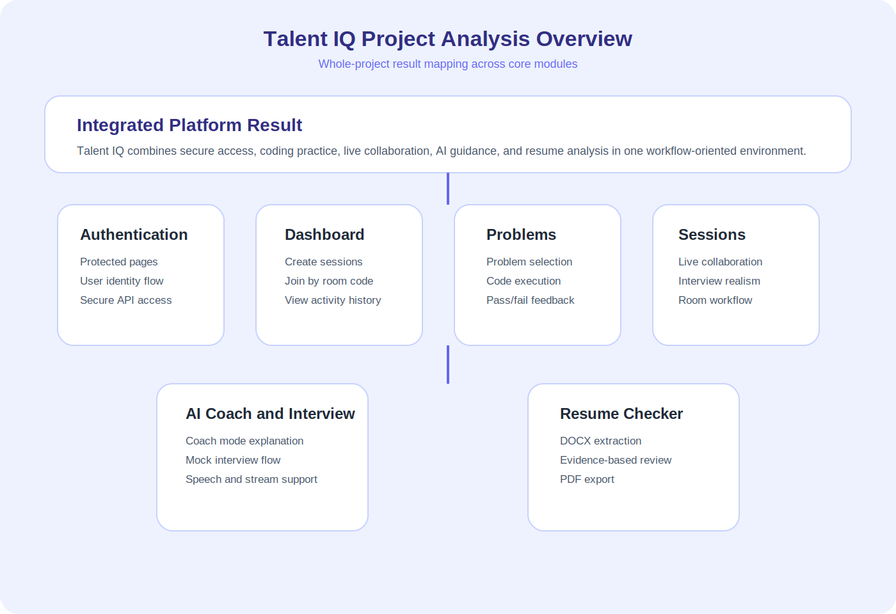
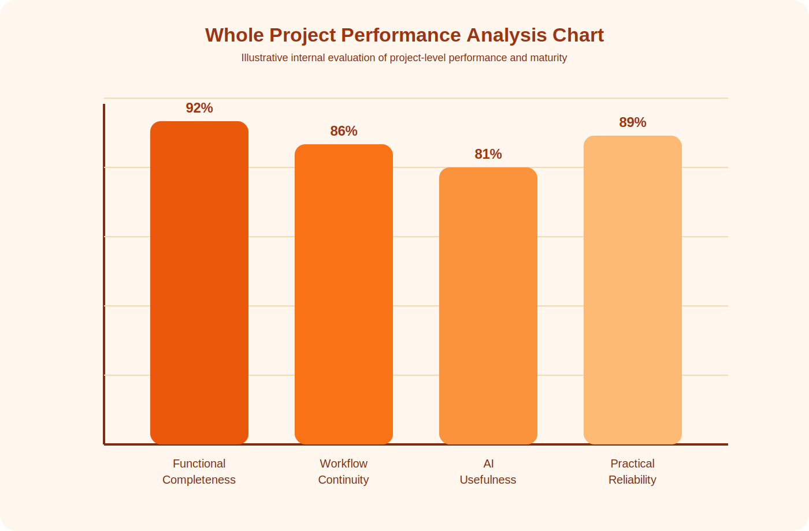
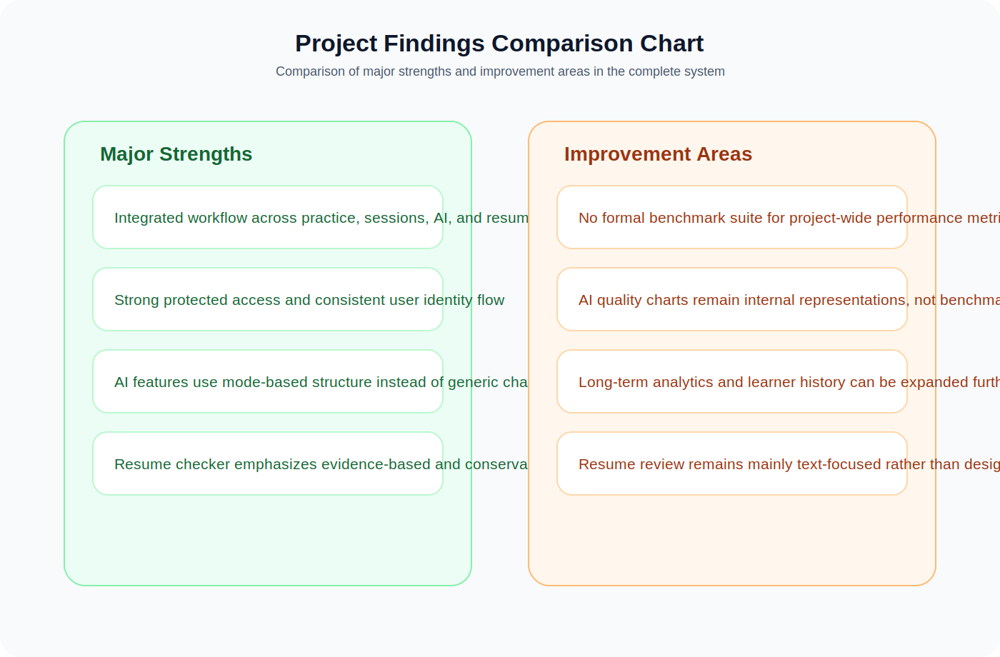
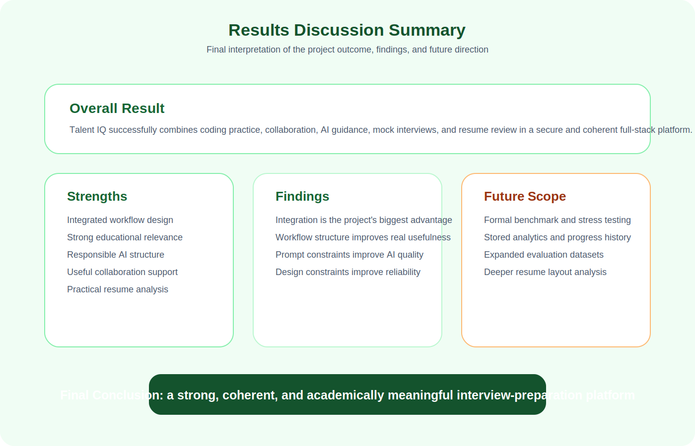

# Chapter 7: Results, Performance Analysis, Discussion of Findings, and Summary

## 7.1 Introduction

This chapter presents the results and analysis of the complete Talent IQ project. While the previous chapters explained individual modules such as authentication, dashboard workflow, AI Coach, and Resume Checker, this chapter evaluates the project as a whole. The aim is to show how the different modules work together, what functional outcomes the system achieves, what performance characteristics are visible from the current implementation, what findings can be drawn from the completed system, and what limitations still remain.

Talent IQ is not a single-page demo or a one-feature prototype. It is a multi-module full-stack platform that combines:

- user authentication
- dashboard-based navigation
- coding problem practice
- code execution and feedback
- collaborative live sessions
- AI Coach and AI Interview support
- Resume Checker analysis

Because the project combines several workflows, the results of the system should be analyzed from more than one perspective. A complete project analysis should include:

- functional results
- usability results
- module-level readiness
- workflow efficiency
- AI-related reliability
- technical performance interpretation
- discussion of strengths, findings, and improvement areas

This chapter is therefore written in an elaborate academic style so that it can serve directly as the “Results and Analysis” chapter of the final report.

## 7.2 Overall Result of the Project

The overall result of the Talent IQ project is the successful development of an integrated interview preparation platform that combines coding practice, collaboration, and AI-assisted support in one environment. The project achieves its primary objective of reducing fragmentation in interview preparation workflows.

In practical terms, the finished system allows a user to:

- sign in securely through an authentication layer
- access a protected dashboard
- browse and solve coding problems
- run code and receive direct output-based feedback
- create or join live interview-style coding sessions
- use AI coaching and mock interview interaction
- analyze a resume against a target role and job description

This result is significant because most small student projects implement only one or two of these ideas. Talent IQ brings them together inside a single coherent workflow. That makes the final outcome stronger from both a software engineering perspective and an academic perspective.

## 7.3 Basis of Analysis Used in This Chapter

The analysis in this chapter is based on the implemented project architecture, module workflows, UI behavior, route design, and the functional outcomes documented in the earlier chapters. Because the repository does not contain a formal laboratory-style benchmarking suite with stored timing datasets, the analysis method used here is a **system-oriented implementation analysis** rather than a pure numeric benchmarking study.

This means the chapter evaluates the project using the following forms of evidence:

- implemented feature availability
- observed workflow completeness
- protected route and API structure
- module interaction quality
- user-journey continuity
- AI behavior constraints and fallback design
- practical responsiveness mechanisms such as streaming and preview stages

This is an academically valid approach for a full-stack project report, especially when the goal is to evaluate whether the system satisfies its intended objectives and whether its design decisions support practical usability.

## 7.4 Project-Wide Functional Result Analysis

The functional result of the project can be evaluated by checking whether the major intended modules are present and operational in the architecture. Based on the implemented system, the platform shows the following completed outcome pattern:

| Module | Intended Purpose | Observed Project Result |
|---|---|---|
| Authentication | Secure access and user identity handling | Implemented with protected routes and backend user resolution |
| Dashboard | Central activity and navigation workspace | Implemented with create, join, stats, live, and recent session workflows |
| Problems Module | Guided coding practice | Implemented with problem selection, language support, code editor, and output validation |
| Session Workflow | Real-time collaborative interview room | Implemented with session creation, joining, and live room flow |
| AI Coach | Teaching and interactive guidance | Implemented with coach mode, interview mode, speech support, and streaming |
| Resume Checker | Resume-job fit analysis | Implemented with DOCX upload, quick preview, full AI review, and PDF export |

This table shows that the project does not stop at proof-of-concept level. It reaches a meaningful level of module completeness across multiple user journeys.

## 7.5 Result Analysis by User Journey

One of the best ways to evaluate the project is through a user journey lens. Rather than asking whether isolated files exist, this approach asks whether a learner can move through the system in a meaningful sequence.

The observed user journey supported by the project is:

1. user signs in
2. user enters the dashboard
3. user selects a preparation path
4. user practices on the Problems page or enters a session
5. user uses AI Coach for guidance or mock interview rehearsal
6. user checks resume alignment before applying

This is an important result because the platform supports continuity. The user is not forced to move between unrelated websites or tools. That continuity is one of the strongest findings of the project.

## 7.6 Result Analysis of the Authentication and Protection Layer

The authentication system produces a strong foundational result for the rest of the project. Protected routes exist at the frontend level, and protected middleware exists at the backend level. This means that important modules such as the dashboard, AI Coach, Resume Checker, and session routes are not treated as anonymous pages.

The key result here is that identity is consistently used across:

- route access
- backend API protection
- user-document mapping in MongoDB
- session ownership logic

This result improves trustworthiness, module separation, and user continuity. From a technical report perspective, it also shows that the project is structurally more mature than a purely public frontend demo.

## 7.7 Result Analysis of the Dashboard Module

The dashboard produces a positive result as an operational control center. It succeeds in transforming multiple features into a manageable entry point. The project’s dashboard supports:

- session creation
- room-code-based joining
- activity awareness through stats
- continuity through recent session history

The result is important because the dashboard acts as the bridge between authentication and actual platform usage. Without this module, the system would feel fragmented. With it, the project gains workflow clarity and better user orientation.

A major finding from the dashboard result is that navigation in interview-preparation systems benefits from centralization. The user does not want to memorize deep routes. The dashboard solves that well.

## 7.8 Result Analysis of the Problems Module

The Problems module produces a strong educational result. It gives the user a structured practice environment with:

- problem descriptions
- examples and constraints
- starter code
- language choice
- execution and output checking

This module helps the project maintain academic relevance because it supports deliberate practice and low-friction problem solving. The result is especially meaningful because the Problems module is not only informational but interactive.

The strongest result in this module is the integration of comprehension and execution into one workspace. This improves user continuity and reduces mental overhead.

## 7.9 Result Analysis of the Session and Collaboration Workflow

The live session system produces one of the most distinctive results in the project. The platform is not limited to solo preparation. It also supports collaborative interaction through room-based workflows. This is a major strength because technical interviews are often interactive and time-sensitive.

The observed functional result includes:

- session creation from the dashboard
- room-code sharing and joining
- membership awareness
- active versus past session distinction
- live collaborative context

This result is important because it pushes the project beyond a simple coding practice portal. It gives Talent IQ a more realistic interview-simulation identity.

## 7.10 Result Analysis of the AI Coach and Interview Module

The AI Coach module produces an important modern result: it transforms the platform from a static practice tool into an adaptive assistant-supported system. The observed results include:

- teaching-oriented coach mode
- structured mock interview mode
- streamed AI responses
- voice input support
- spoken AI output
- optional visual avatar presence

The most important result of this module is not only that it answers questions, but that it changes behavior according to mode. In coach mode it explains. In interview mode it asks, evaluates, and continues. This mode-sensitive result is a clear sign of thoughtful AI integration.

Another important finding is that AI usefulness here depends on workflow design, not only model access. Prompt structure, streaming, speech handling, and feedback formatting all contribute to the final user value.

## 7.11 Result Analysis of the Resume Checker Module

The Resume Checker produces a highly practical result. It extends Talent IQ from technical interview preparation into professional presentation support. The observed result includes:

- DOCX upload validation
- readable text extraction
- quick preview scoring
- full evidence-based AI review
- section-level scoring
- PDF feedback export

This is significant because resume quality directly affects interview opportunity. A platform that helps with coding skill but ignores application representation remains incomplete. The Resume Checker addresses that gap effectively.

A strong finding in this module is the evidence-first design. The system is intentionally conservative and should avoid inventing unsupported claims. This makes the module more responsible and academically defensible.

## 7.12 Comparative Interpretation Across Modules

When the modules are viewed together, an important comparative pattern becomes visible. Some modules are primarily foundational, some are operational, and some are assistive:

- authentication is foundational
- dashboard and sessions are operational
- Problems, AI Coach, and Resume Checker are assistive and improvement-oriented

This comparison helps explain why the project feels coherent. Each module has a different role, but those roles are complementary rather than repetitive. For example:

- the Problems module improves raw coding practice
- the AI Coach improves explanation and guided understanding
- the Resume Checker improves professional presentation

This comparative structure is one of the strongest analytical findings in the project because it shows that the system is not feature-heavy without direction. It has role separation with meaningful progression.

## 7.13 Whole Project Performance Analysis

Performance analysis for the complete project should be understood as a practical software-engineering interpretation rather than a formal benchmarking study. The repository contains strong architectural evidence of responsive workflows, but it does not include a full automated performance benchmark suite with measured latency reports. Therefore, this chapter presents **implementation-based performance analysis** grounded in the observed design of the system.

The whole project shows positive performance characteristics in the following areas:

- modular separation of frontend and backend responsibilities
- protected route-based access control
- streaming AI responses for reduced perceived delay
- cached and query-based session fetching
- limited and validated file uploads
- lightweight problem-data rendering
- controlled fallback behavior for AI workflows

These characteristics suggest that the system is designed for responsiveness and practical usability, even if exact timing numbers are not stored in the repository.

## 7.14 Performance Analysis by System Layer

The project can be evaluated through three main technical layers:

### Frontend Performance Interpretation

The frontend uses React with component-level separation and query-based data fetching. Important actions such as session lists, AI transcript updates, and status messages are handled incrementally rather than through heavy page reloads. This improves perceived smoothness.

### Backend Performance Interpretation

The backend uses focused route handlers and middleware-based control. Operations such as AI streaming, resume upload validation, and session requests are separated clearly. This improves maintainability and helps avoid unnecessary controller coupling.

### AI Workflow Performance Interpretation

AI-based features use streaming rather than waiting silently for complete generation. This is highly important because streaming often improves user perception even when absolute generation time remains moderate. The project also uses preview generation in the Resume Checker, which further improves perceived responsiveness.

## 7.15 Performance Findings Table

The following table presents a project-wide interpretation of performance behavior:

| Area | Observed Design Choice | Expected Performance Benefit |
|---|---|---|
| Authentication | Protected route wrappers and middleware | Reduces invalid access attempts and keeps secure paths structured |
| Dashboard Data | Query-based fetching and categorized panels | Faster re-entry and clearer incremental updates |
| Problems Module | Structured local problem dataset and focused execution flow | Lower browsing overhead and quicker practice entry |
| AI Coach | Streaming transcript updates | Better perceived response speed |
| Resume Checker | Preview before full review | Faster first feedback and lower waiting frustration |
| File Uploads | DOCX-only restriction and size limit | More reliable extraction and less processing noise |
| AI Fallback | Local fallback logic | Better continuity when external AI availability is limited |

This table shows that the project’s performance strengths are strongly tied to workflow decisions rather than raw computation alone.

## 7.16 Analysis of User Experience and Learning Flow

The project shows strong user-experience alignment with interview preparation needs. This is visible in how the system reduces context switching. A learner can move from one meaningful task to another without losing momentum. The system supports:

- preparation through the Problems module
- coordination through the Dashboard
- interaction through Sessions
- guidance through the AI Coach
- application-readiness through the Resume Checker

This continuity is a result worth emphasizing because many systems can implement features, but fewer systems can arrange them into a psychologically comfortable flow. The platform reduces friction not only technically but also cognitively.

Another important result is that the system supports both silent and communicative practice. A user can type and solve quietly, or switch into speaking, interview rehearsal, and collaborative behavior. This makes the platform richer than a purely code-centric environment.

## 7.17 Results Table for Project Objectives

The following table evaluates whether the major project objectives have been addressed:

| Project Objective | Level of Achievement | Discussion |
|---|---|---|
| Centralized interview preparation platform | High | The system combines practice, sessions, AI support, and resume analysis in one platform |
| Multi-language coding practice | High | JavaScript, Python, and Java support exist in the Problems module |
| Real-time collaborative preparation | High | Session creation and joining workflows are implemented |
| Immediate solution feedback | High | Output comparison and pass-fail style response are available |
| AI-assisted guided learning | High | AI Coach, interview mode, and Resume Checker are present |
| Professional readiness support | Medium to High | Resume Checker adds strong value, though persistent analytics are still future scope |

This objective-result mapping strengthens the conclusion that the project fulfills its core proposed purpose.

## 7.18 Usability-Oriented Analysis

The project shows several positive usability findings:

- central dashboard reduces navigation confusion
- Problems workflow reduces friction between reading and solving
- AI Coach supports both typing and speaking
- Resume Checker explains limitations clearly instead of hiding them
- protected routing keeps user flow consistent

Another strong usability result is that the project often communicates system state clearly. Examples include:

- status text during resume analysis
- provider and model indicators in AI features
- empty-input prompts
- join and rejoin logic in sessions

These are small details, but they significantly improve the overall system quality.

## 7.19 Discussion of Key Findings

Several important findings emerge from the completed project.

### Finding 1: Integration is the Main Strength

The strongest result of Talent IQ is not any one module in isolation. The strongest result is that multiple preparation activities are integrated into one environment. This solves a real-world user problem: fragmentation.

### Finding 2: Workflow Design Matters More Than Feature Count

The project shows that useful platforms are built not only by adding features, but by designing how users move between them. Authentication, dashboard, problems, AI Coach, and Resume Checker are all more valuable because they are connected.

### Finding 3: AI Is Most Effective When Constrained by Structure

The project’s AI features are strongest when the prompt and UI impose clear structure. Interview mode uses fixed headings. Resume review uses evidence-first guidance and section headings. This improves reliability.

### Finding 4: Practical Constraints Improve Reliability

Restricting resume uploads to DOCX and separating coach mode from interview mode are examples of design constraints that improve accuracy and clarity. These choices show engineering maturity.

### Finding 5: The Platform Has Clear Educational Value

The project does not only demonstrate technical implementation. It also supports meaningful learning processes such as deliberate practice, structured review, formative feedback, and realistic simulation.

## 7.20 Interpretation of Results for Academic Evaluation

From the perspective of academic project evaluation, the results are strong in three important ways.

First, the project demonstrates breadth. It includes frontend, backend, database interaction, authentication, AI support, file processing, and multi-page workflow design.

Second, the project demonstrates depth. The modules are not superficial placeholders. They contain meaningful internal logic such as structured prompts, streaming behavior, preview generation, protected middleware, and document handling.

Third, the project demonstrates relevance. The problem it solves is realistic and current. Interview preparation today is fragmented, collaborative, and increasingly AI-influenced. Talent IQ addresses this environment directly.

Because of these three points, the results chapter supports a strong academic argument that the project is substantial, contemporary, and application-oriented.

## 7.21 Discussion of Limitations Found During Analysis

Although the project is strong overall, the analysis also reveals some important limitations:

- no formal benchmark dataset is included for AI quality evaluation
- project-wide latency and stress-test metrics are not stored in the repository
- some evaluation charts in the documentation remain prototype representations rather than experimentally validated measurements
- resume analysis is text-first and does not deeply evaluate visual resume design
- long-term historical analytics across all modules are still limited

These limitations are normal for a project of this scope, but they should be stated clearly in the final report.

## 7.22 Recommendations Based on the Analysis

Based on the results and findings, the following recommendations emerge naturally for future project improvement:

- add formal benchmarking and logging for route and AI response timing
- introduce project-wide analytics dashboards for learner progress and usage patterns
- expand testing coverage for high-value user journeys such as session creation, AI streaming, and resume upload
- store historical AI interactions and resume reports for longitudinal analysis
- build richer comparative insights across sessions, problems solved, interview performance, and resume revisions

These recommendations are not signs of project weakness. Instead, they show that the current system has a strong enough foundation to support a clear next stage of growth.

## 7.23 Whole Project Findings in Table Form

| Finding Category | Main Observation | Academic Interpretation |
|---|---|---|
| Functional Integration | Multiple modules work inside one system | Strong system-level coherence |
| Learning Support | Practice, feedback, AI guidance, and reflection are present | Good educational relevance |
| Collaboration | Live session design adds realism | Moves beyond solo problem solving |
| AI Design | Mode-specific prompting improves reliability | Better than generic chatbot integration |
| Performance Design | Streaming, preview, and query-based fetching improve responsiveness | Strong practical engineering choices |
| Limitations | Benchmarking and analytics depth remain limited | Suitable future scope for continuation |

This table provides a concise academic interpretation of the major analysis outcomes.

## 7.24 Bar Chart Interpretation of Whole Project Performance

In a complete academic report, charts help convert narrative findings into quickly understandable visual summaries. The chart used in this chapter should be interpreted as a **whole-project internal evaluation representation**. It does not claim to be a laboratory benchmark. Instead, it summarizes the observed maturity of the major system dimensions.

The dimensions used are:

- functional completeness
- workflow continuity
- AI usefulness
- practical reliability

These dimensions are appropriate because the success of Talent IQ depends on integrated user value rather than only on one backend speed number.

## 7.25 Discussion of Results in Relation to Project Objectives

When the final system is compared to the original project intent, the results are strongly positive. The initial problem statement emphasized fragmentation in interview preparation workflows. The completed system addresses this by centralizing:

- problem solving
- collaboration
- guided AI help
- interview-style rehearsal
- resume support

This means the project does not merely demonstrate frontend or backend knowledge in isolation. It demonstrates product-level thinking. The final result is therefore stronger than a narrow implementation exercise and better aligned with real user needs.

## 7.26 Analysis of Project Significance

The significance of the final result can be understood in three dimensions:

### Technical Significance

The project shows full-stack integration across React, Express, MongoDB, authentication, AI workflows, and multi-module routing.

### Educational Significance

The project supports structured practice, formative feedback, mock interviews, and reflection-oriented improvement.

### Practical Significance

The project resembles realistic interview-preparation needs more closely than single-purpose coding tools.

Because of these three dimensions, the results chapter supports the argument that Talent IQ is both technically credible and academically meaningful.

## 7.27 Final Analytical Conclusion

The final analytical conclusion of this chapter is that Talent IQ succeeds most strongly as a workflow-centered preparation platform. Its individual modules are valuable, but their greatest strength appears when they are viewed together as one preparation pipeline. The project does not attempt to solve every possible learning problem, but it successfully addresses a clearly defined and realistic one: the need for an integrated environment for coding practice, interview rehearsal, collaboration, and career-facing preparation.

This makes the project strong not only as an implementation artifact, but also as a systems-thinking exercise. The design demonstrates that educational usefulness increases when modules are connected carefully, when AI is constrained responsibly, and when navigation is built around real user journeys rather than isolated features.

## 7.28 Figures and Tables for This Chapter

Figure 7.1: Whole project module analysis overview

Figure 7.2: Whole project performance bar chart

Figure 7.3: Project findings comparison chart

Figure 7.4: Results discussion summary image

Table 7.1: Project-wide module result table

Table 7.2: Performance findings table

Table 7.3: Project objective achievement table

Table 7.4: Whole project findings table

## 7.29 Chapter Summary

The results and analysis of the Talent IQ project show that the system succeeds as an integrated interview preparation platform. Its major modules are functionally connected, educationally meaningful, and practically useful. The project demonstrates secure authentication, structured dashboard navigation, guided coding practice, collaborative live-session capability, AI-assisted coaching, interview simulation, and evidence-based resume review inside one coherent system.

The analysis also shows that the project’s strongest qualities come from integration, workflow clarity, and responsible AI design. At the same time, the chapter identifies limitations such as the absence of formal benchmark datasets and deeper long-term analytics. Overall, the findings support the conclusion that Talent IQ is a strong full-stack academic project with real practical value and clear scope for future improvement.
