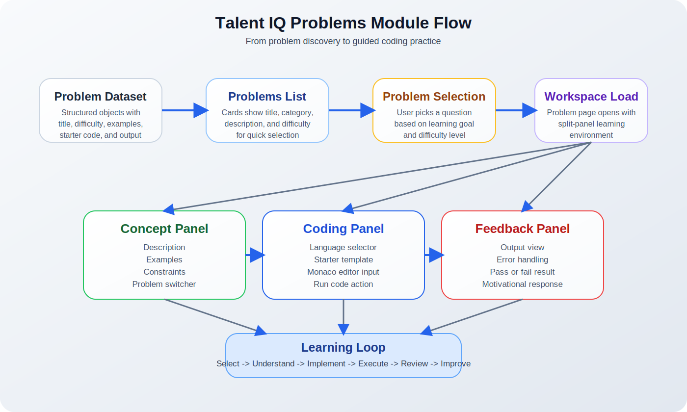
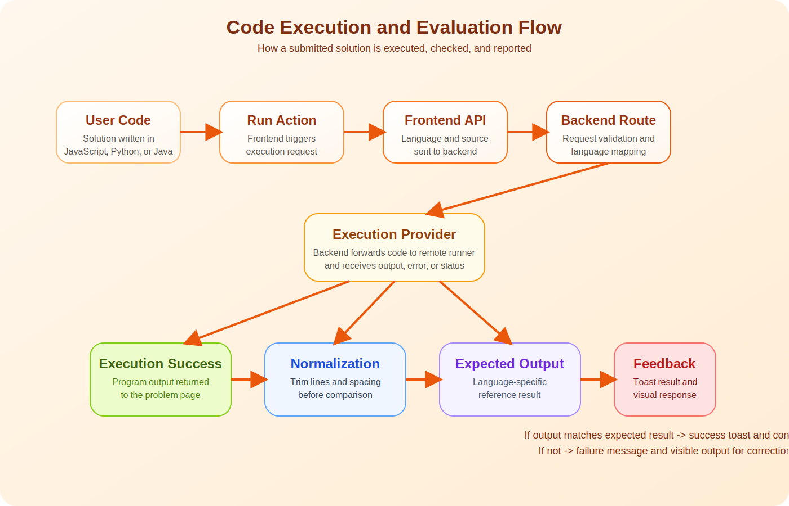

# Talent IQ Project Documentation

## Chapter 1: Introduction

### 1.1 Project Title
Talent IQ is a full-stack interview preparation and collaborative coding platform designed to support technical practice, live sessions, and guided skill development in one environment.

### 1.2 Project Overview
The project combines three major ideas into a single system: coding interview practice, collaborative interview sessions, and AI-assisted support. Instead of separating preparation from execution, Talent IQ brings together a problem-solving workspace, a live interview room, and assistant-driven features. This helps users move from individual preparation to interactive assessment without switching between multiple tools.

At the system level, the platform follows a modern client-server architecture. The frontend is responsible for user interaction, page rendering, editor behavior, and session experience. The backend is responsible for API delivery, protected routes, session management, AI endpoints, and code execution orchestration. External services are integrated where they add value, such as authentication, real-time communication, and code execution.

In the present educational and recruitment landscape, technical interviews have become more interactive, time-sensitive, and skill-oriented. Learners are expected not only to know programming concepts but also to apply them clearly under observation, justify decisions, communicate with peers or interviewers, and react to feedback quickly. Traditional practice methods such as isolated coding in local editors or reading problem lists from static websites do not fully simulate these realities. Talent IQ is therefore positioned as a bridge between theoretical preparation and realistic interview performance.

The project is also motivated by the increasing convergence of three domains: edtech, collaborative software development, and AI-supported productivity. Students today expect systems that are immediate, interactive, and adaptive. A modern preparation platform must therefore do more than display questions. It must guide, structure, evaluate, and support the learner continuously. Talent IQ reflects this shift by integrating problems practice, collaborative sessions, and AI-related assistance within one digital ecosystem.

### 1.3 Objectives
The main objectives of the project are:

- To create a centralized platform for coding interview preparation.
- To allow users to practice algorithmic problems in multiple programming languages.
- To support real-time interview sessions with collaboration features.
- To provide immediate execution feedback on coding solutions.
- To improve the learning experience through structured interaction and guided workflows.

### 1.4 Scope of the Project
Talent IQ is intended for students, job seekers, mentors, and interviewers. The scope of the system includes solo coding practice, problem browsing, session creation, code execution, interview-oriented workflows, and AI-assisted support modules. The current implementation focuses on educational usefulness, workflow clarity, and practical interview preparation.

From an academic perspective, the project falls within the scope of technology-enhanced learning systems, collaborative computing environments, and software engineering education tools. From an application perspective, it fits the needs of coding practice platforms, mock interview systems, and guided technical preparation portals. The present version of the project emphasizes functional integration, usability, and modular growth potential rather than only algorithmic novelty.

The project does not attempt to replace industrial-scale coding platforms or full learning management systems. Instead, it focuses on a targeted and valuable niche: combining structured coding practice with collaborative interview readiness. This makes the system realistic in implementation scope while still academically meaningful as a software project.

### 1.5 Need for the Project
Many students preparing for technical interviews face fragmented workflows. They may read problems from one platform, write code in another editor, test it in a different environment, discuss with peers on a separate communication tool, and depend on external resources for guidance. This fragmentation reduces efficiency and weakens learning continuity.

Another issue is the gap between problem-solving ability and interview readiness. A learner may solve algorithmic questions independently but still struggle in a live coding context that requires communication, pacing, pressure management, and quick correction. Talent IQ addresses this need by integrating both practice and interaction into one environment.

There is also a growing need for accessible multi-language practice environments. Students come from different academic and technical backgrounds; some are most comfortable with Java, others with Python or JavaScript. A flexible platform that supports multiple languages with starter templates and direct execution lowers entry barriers and improves participation.

### 1.6 Significance of the Project
The significance of Talent IQ lies in its integrated design philosophy. Instead of building a single-purpose coding tool, the project demonstrates how multiple learning and interview-support functions can work together within one coherent system. For academic evaluators, this makes the project significant as a full-stack application with practical, educational, and human-centered value.

The system is also significant because it aligns with current industry trends. Collaborative development, remote interviews, AI-assisted workflows, and immediate feedback mechanisms are now common in technical ecosystems. A student project that reflects these trends demonstrates not only programming ability but also awareness of real-world workflow design.

## Chapter 2: Problems Page Module

### 2.1 Introduction to the Problems Page
The Problems Page is one of the academic and functional cores of Talent IQ. It is not just a list of questions; it is a guided problem-solving environment. In interview preparation systems, the quality of the problem module often determines how effectively a user can build confidence, analytical depth, and execution speed. For that reason, the Problems Page in Talent IQ is designed as a structured learning surface rather than a plain question bank.

This module supports users in three stages. First, it helps them discover a problem based on title, category, and difficulty. Second, it helps them understand the problem through description, examples, and constraints. Third, it allows them to implement and test a solution instantly inside the same workspace. This reduces context switching and makes learning more continuous.

### 2.2 Educational Role of the Module
From a theoretical point of view, problem-solving platforms are effective when they support active learning. Active learning means the user is not just reading content but also engaging in classification, reasoning, implementation, and verification. The Problems Page supports this by combining problem metadata, conceptual explanation, coding input, and output-based evaluation.

The module also reflects the principle of scaffolded learning. Each problem contains a description, notes, examples, constraints, starter code, and expected output. These parts act as learning scaffolds:

- The description introduces the task and the computational goal.
- Notes clarify hidden rules, interview expectations, or implementation boundaries.
- Examples translate theory into concrete sample behavior.
- Constraints communicate performance expectations and guide algorithm choice.
- Starter code reduces setup difficulty and helps the learner focus on logic.
- Expected output allows direct self-validation through observable results.

This structure is especially useful in interview preparation because learners must move from understanding to execution under time pressure.

In pedagogical terms, the Problems Page also supports self-regulated learning. Self-regulated learning refers to the learner’s ability to plan, monitor, and evaluate their own learning process. When a user selects a problem by difficulty, attempts a solution, checks output, and revises their code, they are engaging in a self-regulated cycle. This makes the module valuable not only as a technical feature but also as a learning mechanism.

Another educational value of the module is its support for deliberate practice. Deliberate practice is different from casual repetition because it involves focused effort, clear goals, measurable response, and iterative correction. The Problems Page reflects these principles by presenting structured tasks and giving instant outcomes that help the learner improve through repeated attempts.

### 2.3 Functional Theory Behind the Problems Page
The module is based on a data-driven content model. Each problem is stored as a structured object in the problem dataset. Because the page reads from structured data instead of hardcoded page sections, the system becomes scalable and maintainable. New problems can be added with the same schema and immediately become available inside the user interface.

This data-driven design has theoretical importance in software architecture as well. Content modeling separates the learning resource from the rendering layer. As a result, the interface becomes reusable, the data becomes extensible, and the system becomes easier to maintain. In practical terms, this means the project can scale from a smaller academic demo into a larger repository of problems without major redesign.

The flow begins with the Problems listing page, where users see curated questions with visible difficulty labels and categories. This first layer supports recognition-based navigation. Rather than forcing the user to search blindly, the interface provides a quick overview that helps in choosing the next task according to confidence and learning goals.

When a problem is selected, the user is taken to the dedicated problem workspace. This workspace is divided into logical panels. The left panel contains the conceptual side of the exercise, including title, description, examples, and constraints. The right panel contains the practical side, including the code editor and output area. This split-panel design is theoretically significant because it mirrors the dual process of problem solving:

- comprehension and interpretation on one side
- implementation and validation on the other side

This arrangement helps the learner continuously move between reading and coding without losing visual context.

This is also an example of cognitive ergonomics in interface design. By keeping problem context and coding context visible in the same workspace, the platform reduces memory burden. The learner does not need to repeatedly navigate across pages or mentally store all instructions before starting implementation. Instead, the interface itself supports thinking by keeping the required information close to the action area.

### 2.4 Theory of Difficulty Classification
The Problems Page uses three standard levels: Easy, Medium, and Hard. This categorization is not only a visual label; it is part of the pedagogical design of the system.

- Easy problems introduce direct logic, basic data structures, and entry-level reasoning.
- Medium problems typically require stronger pattern recognition, optimized thinking, and multi-step logic.
- Hard problems represent interview-level complexity, advanced data structures, or deeper algorithmic design.

Difficulty classification helps in progression planning. A learner may begin with easy problems to build confidence, move to medium problems for pattern mastery, and finally attempt hard problems to simulate real interview pressure. In this way, the Problems Page supports incremental growth rather than random exposure.

### 2.5 Theory of Interaction Design
The user experience of the Problems Page follows the principle of reduced friction. The system minimizes the number of actions required to begin solving a problem:

1. Open the problems list.
2. Select a problem.
3. Choose a language.
4. Edit the starter code.
5. Run the solution.
6. Inspect the output and feedback.

This flow is valuable because good educational systems preserve cognitive energy for reasoning rather than interface management. The page therefore avoids unnecessary complexity in favor of direct learning interaction.

The module also includes a problem selector in the problem workspace itself. This design supports continuity. Once the user is inside the solving environment, they can switch to another problem without returning to the list page. The theoretical advantage is smoother task transition and stronger session continuity.

### 2.6 Theory of Code Evaluation
The code execution model used by the Problems Page is based on observable output comparison. When the user runs code, the program output is compared with the expected output for the selected language. Before comparison, outputs are normalized so that minor spacing differences do not unfairly fail a correct solution. This shows a practical evaluation principle: the system checks semantic closeness in visible output rather than exact formatting noise.

If the execution succeeds and the normalized output matches the stored expected output, the user receives a positive response. If not, the system provides failure feedback. This feedback loop is important in learning theory because immediate response supports correction, reflection, and faster iteration.

The module therefore acts as a lightweight auto-evaluation environment. It is not meant to replace a full online judge with hidden test cases, but it effectively supports practice, experimentation, and confidence building.

From an assessment theory perspective, the current model can be understood as formative rather than summative. Formative assessment supports improvement during the learning process, whereas summative assessment is mainly concerned with final judgment. The Problems Page is formative because it encourages repeated trial, feedback interpretation, and refinement. This is especially useful for interview preparation, where growth through iteration matters as much as final correctness.

The normalization step also reflects fairness in digital assessment. Learners should not be penalized for trivial formatting differences when the intended logic is correct. By reducing such unnecessary friction, the module creates a more learner-friendly environment while preserving the value of correctness checking.

### 2.7 Theory of Language Flexibility
The page supports JavaScript, Python, and Java. This multi-language support reflects an important design principle in learning systems: concept transfer across syntax boundaries. Users may solve the same logical problem in different programming languages, which helps distinguish algorithmic thinking from language-specific syntax.

Starter code is provided for each supported language. This improves accessibility because learners can immediately begin in a familiar programming environment. It also reduces the setup burden and makes the module more inclusive for users coming from different academic or professional backgrounds.

This feature is also aligned with the diversity of technical interviews. Not all interviews are language-specific. Many organizations allow candidates to use any mainstream language that expresses the solution clearly. A practice environment that offers multiple language options therefore better reflects real interview flexibility than a single-language training tool.

### 2.8 Role of the Problems Page in the Overall Project
The Problems Page is not an isolated feature; it is one of the core academic identities of Talent IQ. It complements the collaborative session features by preparing users at the individual level. A learner can first build confidence through solo problem solving and later move into live session activities with better readiness.

In this sense, the Problems Page serves as the foundation layer of the project. It anchors the project in structured technical practice. Without a strong problem-solving module, the collaborative aspects would have less educational depth. Thus, Chapter 2 is central to understanding why Talent IQ is more than a video-call or session-management platform.

### 2.8 Problems Page Flow
The Problems module can be understood as a guided pipeline:

1. The system loads the structured problem dataset.
2. The Problems Page converts that dataset into visible cards.
3. The user selects a problem from the list.
4. The problem workspace loads its metadata and starter code.
5. The user chooses a programming language and writes a solution.
6. The code is sent for execution through the backend.
7. The result is displayed in the output panel.
8. The output is checked against the expected result.
9. The user receives pass or fail feedback.

This pipeline shows how the module connects content, interface, execution, and feedback into one complete learning loop.

### 2.9 Problems Page Images
The following figures explain the flow of the Problems module:

Figure 2.1: Problems navigation and learning flow

Figure 2.2: Code execution and evaluation flow

### 2.10 Chapter Summary
The Problems Page is both a UI feature and a pedagogical system. It organizes coding practice into a structured cycle of selection, understanding, implementation, execution, and feedback. Its theoretical strength lies in scaffolded content, difficulty-based progression, low-friction interaction, and immediate reinforcement. Because of this, Chapter 2 represents more than just a feature description; it explains how Talent IQ supports disciplined interview preparation through guided technical practice.

## Chapter 3: Research Background and Literature Review

### 3.1 Introduction to the Literature Review
This chapter places Talent IQ in the context of existing academic research on programming education, online judge systems, automated feedback, collaborative coding, intelligent tutoring, and AI-supported software practice. The purpose of this chapter is not only to list previous work, but also to identify what has already been solved in research and what gaps still remain in practical educational platforms.

The selected papers are closely related to the core ideas behind Talent IQ:

- coding problem practice through structured platforms
- automatic evaluation and feedback
- collaborative and pair programming
- intelligent or AI-assisted learning support
- learner analytics and progress tracking

Together, these studies show that students benefit from immediate feedback, guided problem selection, collaborative programming environments, and personalized support. However, they also show that these features are often studied separately. This observation is important because Talent IQ combines many of them inside one workflow-oriented platform.

### 3.2 Review of 10 Relevant Papers

#### Paper 1
**Main heading:** A Recommender System for Programming Online Judges Using Fuzzy Information Modeling

This paper studies programming online judges as learning platforms where students must choose suitable problems from a very large collection. The authors propose a recommendation framework that uses fuzzy methods to reduce information overload and suggest better-matched problems to learners. The paper is highly relevant because the Problems Page in Talent IQ also depends on the idea that structured question selection strongly influences learning effectiveness.

**Research gap identified:** This work focuses on recommending suitable problems, but it does not integrate collaborative solving, interview-oriented workflows, or a complete practice environment that includes coding, execution, and guided multi-feature interaction. That gap supports the need for platforms like Talent IQ that combine problem selection with a broader interview preparation experience.

Source: https://www.mdpi.com/2227-9709/5/2/17

#### Paper 2
**Main heading:** SCFH: A Student Analysis Model to Identify Students’ Programming Levels in Online Judge Systems

This paper discusses how online judge systems can be used not only for evaluation but also for identifying learner ability levels. It recognizes that learners have unequal programming proficiency and proposes a model to better understand student progress in online judge environments. This is relevant to Talent IQ because the project already organizes problems by difficulty and can evolve toward more adaptive practice support.

**Research gap identified:** The study is centered on level identification inside online judge systems, but it does not address integrated user experience, live interview collaboration, AI assistance, or beginner-friendly coding workflows across multiple modules. The gap suggests a need for systems that combine analytics with direct learning support and interview simulation.

Source: https://www.mdpi.com/2073-8994/12/4/601

#### Paper 3
**Main heading:** Bibliometric Analysis of Automated Assessment in Programming Education: A Deeper Insight into Feedback

This paper provides a broad research-level view of automated assessment in programming education and emphasizes the importance of timely feedback in learning to program. Rather than introducing one tool, it maps the development of the field and highlights major themes and open issues. This is useful for Talent IQ because the Problems module relies on automated code execution and instant response to user submissions.

**Research gap identified:** The paper surveys the field but does not deliver an applied system that joins automated assessment with collaborative coding, interview practice, and interactive workflow design. Inference from this review: the field has strong knowledge about feedback, but fewer end-to-end student platforms unify feedback with live practice and communication tools.

Source: https://www.mdpi.com/2079-9292/12/10/2254

#### Paper 4
**Main heading:** Lessons learned from designing an open-source automated feedback system for STEM education

This paper presents RATsApp, an open-source automated feedback system that supports personalized and formative feedback in STEM learning. It also allows instructors to monitor student progress. The paper is relevant because Talent IQ also values immediate feedback and could later incorporate deeper learner monitoring or instructor dashboards.

**Research gap identified:** RATsApp focuses on feedback-centered education, but not on technical interview preparation, problem-driven coding practice, or collaborative interview sessions. That leaves room for projects like Talent IQ, which can take feedback ideas from research and apply them to coding-interview contexts.

Source: https://link.springer.com/article/10.1007/s10639-024-13025-y

#### Paper 5
**Main heading:** The Effect of Automated Error Message Feedback on Undergraduate Physics Students Learning Python: Reducing Anxiety and Building Confidence

This paper shows that error messages are often too cryptic for beginners and proposes improved plain-language feedback to reduce frustration and increase confidence. Its importance lies in the recognition that good educational systems should not only judge correctness, but also help learners understand failure. This connects strongly with the output and feedback goals of Talent IQ’s problem-solving environment.

**Research gap identified:** The paper is highly valuable for novice feedback design, but it does not present a full-stack coding platform that combines problem browsing, execution, collaboration, and interview-style progression. A practical gap remains in turning supportive error feedback into a complete preparation ecosystem.

## Chapter 5: AI Coach, AI Interview Workflow, and Evaluation Representation

The complete Chapter 5 write-up for the AI Coach and AI Interview module is provided in the standalone report-ready file below:

- [CHAPTER_5_AI_COACH_INTERVIEW.md](./CHAPTER_5_AI_COACH_INTERVIEW.md)

This chapter includes:

- detailed explanation of Coach mode and Interview mode
- end-to-end workflow of the AI interaction pipeline
- speech input, spoken reply, and avatar integration explanation
- SDLC representation and flowchart representation
- prototype AI accuracy bar chart and academic interpretation

## Chapter 6: Resume Checker Workflow and Evaluation Representation

The complete Chapter 6 write-up for the Resume Checker module is provided in the standalone report-ready file below:

- [CHAPTER_6_RESUME_CHECKER_WORKFLOW.md](./CHAPTER_6_RESUME_CHECKER_WORKFLOW.md)

This chapter includes:

- detailed explanation of resume upload, scanning, preview, and full review flow
- relationship between the Resume Checker and the broader AI subsystem
- DOCX extraction methodology, validation, and evidence-first prompt guardrails
- SDLC representation and workflow flowchart
- prototype evaluation bar chart and academic interpretation

## Chapter 7: Results, Analysis, and Findings

The complete Chapter 7 write-up for project-wide results and analysis is provided in the standalone report-ready file below:

- [CHAPTER_7_RESULTS_AND_ANALYSIS.md](./CHAPTER_7_RESULTS_AND_ANALYSIS.md)

This chapter includes:

- whole-project results and module-level outcome analysis
- performance interpretation tables and bar-chart-style visuals
- discussion of strengths, findings, and limitations
- project-wide summary and academic interpretation

## Chapter 8: Conclusion, Challenges, Limitations, and Future Scope

The complete Chapter 8 write-up for the final concluding discussion is provided in the standalone report-ready file below:

- [CHAPTER_8_CONCLUSION_AND_FUTURE_SCOPE.md](./CHAPTER_8_CONCLUSION_AND_FUTURE_SCOPE.md)

This chapter includes:

- final conclusion of the complete project
- detailed discussion of challenges encountered during development
- honest explanation of current limitations
- elaborate future enhancement directions across all major modules

## Chapter 9: Additional References and Research Papers

The complete Chapter 9 write-up for supplementary references is provided in the standalone file below:

- [CHAPTER_9_ADDITIONAL_REFERENCES.md](./CHAPTER_9_ADDITIONAL_REFERENCES.md)

This chapter includes:

- 13 additional research papers relevant to the project
- direct source links for publisher or journal pages
- short relevance notes showing how each paper connects to Talent IQ

## Chapter 10: User Manual for Talent IQ

The complete Chapter 10 user manual is provided in the standalone file below:

- [CHAPTER_10_USER_MANUAL.md](./CHAPTER_10_USER_MANUAL.md)

This chapter includes:

- introduction to Talent IQ as a remote interview platform
- getting started steps for opening and using the website
- dashboard, problems, AI Coach, and session usage guidance
- resume score prediction workflow and interpretation
- activity history and practical user guidance

Source: https://link.springer.com/article/10.1007/s41979-022-00084-4

#### Paper 6
**Main heading:** Automated Data-Driven Generation of Personalized Pedagogical Interventions in Intelligent Tutoring Systems

This paper studies how intelligent tutoring systems can generate personalized feedback in a data-driven way instead of depending heavily on hand-crafted expert rules. It is relevant to Talent IQ because AI coaching and adaptive feedback are natural future extensions of the platform. The paper supports the idea that learner support should become more personalized and scalable.

**Research gap identified:** The work is strong on personalized tutoring logic, but it does not focus on coding interview platforms that integrate problem repositories, code execution, real-time collaboration, and user-facing practice modules. Inference from the paper: personalization research is mature, but its integration into interview-preparation platforms remains limited.

Source: https://link.springer.com/article/10.1007/s40593-021-00267-x

#### Paper 7
**Main heading:** Self-efficacy and behavior patterns of learners using a real-time collaboration system developed for group programming

This paper explores a real-time collaboration system for programming and examines learner self-efficacy and collaborative behavior. It shows that collaboration tools can reduce barriers for geographically separated learners and that analytics can reveal meaningful behavior patterns. This aligns closely with the collaborative philosophy of Talent IQ.

**Research gap identified:** The study focuses on group programming collaboration, but not on a broader platform that combines collaboration with interview session management, curated coding problems, code execution, and AI-supported learning. The gap supports a hybrid model such as Talent IQ, where collaboration is only one part of a larger preparation pipeline.

Source: https://link.springer.com/article/10.1007/s11412-021-09357-3

#### Paper 8
**Main heading:** Multimodal learning analytics of collaborative patterns during pair programming in higher education

This paper examines pair programming from a multimodal learning analytics perspective and studies collaborative patterns using discourse, behavior, and socio-emotional signals. It is relevant because it demonstrates that pair programming is more complex than simply sharing code; it is also a social and cognitive coordination activity. This perspective is important for any project that supports collaborative interview practice.

**Research gap identified:** The paper provides rich analysis of pair-programming behavior, but it does not result in a practical integrated interview platform for everyday learners. A clear gap remains between educational analytics research and deployable systems that learners can use directly for coding practice and mock interview preparation.

Source: https://link.springer.com/article/10.1186/s41239-022-00377-z

#### Paper 9
**Main heading:** The impact of AI-assisted pair programming on student motivation, programming anxiety, collaborative learning, and programming performance: a comparative study with traditional pair programming and individual approaches

This paper compares AI-assisted pair programming with human pair programming and individual work. It reports that AI-assisted pair programming can improve motivation, reduce anxiety, and improve performance, while human-human collaboration still produces stronger social presence. This paper is highly relevant to Talent IQ because the platform already includes AI-related modules and collaborative coding ideas.

**Research gap identified:** Although the study compares learning modes, it does not deliver a full product ecosystem that joins AI support, problems practice, execution feedback, and interview-oriented workflows in one place. Inference from the study: AI assistance is promising, but platforms still need careful design to balance performance support with human collaboration.

Source: https://link.springer.com/article/10.1186/s40594-025-00537-3

#### Paper 10
**Main heading:** An empirical study on developers’ shared conversations with ChatGPT in GitHub pull requests and issues

This paper studies how developers share ChatGPT conversations during collaborative software work. It shows that AI is increasingly used not just individually, but also as a shared artifact in team collaboration. This insight is relevant to Talent IQ because AI support in coding systems can be treated as a collaborative aid rather than only a private assistant.

**Research gap identified:** The paper studies AI use in professional collaboration spaces such as GitHub, but not in educational coding-practice platforms for students preparing for interviews. This leaves room for platforms like Talent IQ to adapt shared-AI interaction ideas to learning and mock assessment contexts.

Source: https://link.springer.com/article/10.1007/s10664-024-10540-x

### 3.3 Overall Research Gap
Based on the reviewed papers, several recurring gaps can be identified.

First, many studies focus on only one core function at a time. Some focus on online judge recommendation, others on automated feedback, pair programming, AI tutoring, or collaboration analytics. Very few studies translate these ideas into a single learner-facing platform that supports end-to-end interview preparation.

Second, there is a gap between educational theory and practical product integration. Research papers frequently validate one model, one intervention, or one collaborative mechanism, but students and interview candidates typically need a unified system where they can discover problems, solve them, run code, receive feedback, practice with others, and access guided support without switching platforms.

Third, collaborative coding and automated evaluation are often treated as separate domains. In real interview preparation, however, these must work together. Users may practice alone, collaborate with peers, or use AI assistance, while still requiring structured problem content and immediate execution results.

Fourth, AI-assisted learning is growing rapidly, but research still suggests an incomplete understanding of how AI support should be embedded in collaborative and educational programming environments. Talent IQ addresses this direction by combining coding practice and interactive support modules inside the same project.

Another important gap is usability-centered integration. Many papers validate algorithms, recommendation methods, or tutoring interventions, but less attention is given to how students actually move through such systems in practice. A real learner does not experience “recommendation,” “feedback,” and “collaboration” as separate academic categories. They experience them as steps in one journey. This practical integration gap is where projects like Talent IQ become especially relevant.

There is also a gap between novice support and interview realism. Some studies focus heavily on beginner scaffolding, while others focus on advanced collaborative programming or professional AI-assisted development. Few systems attempt to support both the beginner’s need for clarity and the candidate’s need for realistic, interview-oriented preparation. Talent IQ can be viewed as an attempt to move toward that middle ground.

### 3.4 How Talent IQ Addresses the Gap
Talent IQ responds to the identified gaps by combining several research-backed ideas into one integrated platform:

- a curated problem-solving module with difficulty-based progression
- immediate code execution and visible output feedback
- support for multiple programming languages
- collaborative and session-oriented coding experiences
- AI-related support features aligned with modern learner expectations

In other words, while many earlier papers study isolated mechanisms, Talent IQ moves toward a unified practice ecosystem. This makes the project relevant not only as an application, but also as a practical response to fragmented research implementations.

From a design perspective, the project transforms theoretical insights into an implementable product. Research on automated feedback supports the output panel and result checking. Research on online judges supports the structure of the problems dataset and practice model. Research on collaboration supports session-based coding workflows. Research on AI assistance supports future-ready user support mechanisms. The value of the project lies in how these pieces are assembled into a coherent architecture.

### 3.6 Extended Summary of the Literature Review
The literature overall suggests that effective programming education systems should support at least four dimensions: structured practice, timely feedback, learner adaptation, and collaboration. Online judge research contributes to structured practice. Automated feedback research contributes to immediate evaluation and confidence building. Intelligent tutoring research contributes personalization and guidance. Pair-programming and collaborative-learning research contribute social learning and co-construction of knowledge.

However, academic literature also reveals that these dimensions are commonly distributed across separate tools and research traditions. This separation creates a difference between what research knows and what learners actually receive in practice. A student may use a judge system for problems, a chat tool for discussion, a tutorial site for guidance, and an AI assistant for clarification, but these experiences remain disconnected. Talent IQ’s conceptual value lies in bringing these strands closer together.

### 3.5 Chapter Summary
The literature shows that automated feedback, online judges, collaborative programming, intelligent tutoring, and AI-supported learning are all valuable and well-established research directions. However, the review also shows that these ideas are often implemented in isolation. The main research gap, inferred from the reviewed papers, is the lack of integrated platforms that combine structured coding problems, automated evaluation, collaborative practice, and modern support tools for interview preparation. Talent IQ is positioned as a response to that gap.

## Chapter 4: System Architecture

### 4.1 Architectural Style
Talent IQ follows a full-stack web architecture with separated frontend and backend layers. The frontend handles views, user interactions, routing, and coding workspace behavior. The backend manages APIs, authentication middleware, session services, AI routes, and execution services.

The architectural separation is important because it supports maintainability, modular growth, and clearer responsibility boundaries. In academic project evaluation, this separation also demonstrates sound software engineering practice. Rather than mixing all logic into a single layer, the project distributes concerns so that interface behavior, business logic, and service communication remain understandable and extensible.

### 4.2 Frontend Layer
The frontend is built with React and organized around pages, reusable components, hooks, and utility modules. Route protection is used so that major application features are available only to authenticated users. This is important because the platform deals with user sessions, private activity, and personalized data.

The frontend emphasizes component reuse and route-driven navigation. Such design makes the system easier to reason about because each user-facing function is represented through identifiable pages and smaller interactive components. This structure is particularly useful in projects with multiple modules like dashboard management, problems practice, session handling, and AI-related views.

### 4.3 Backend Layer
The backend is built with Express. It exposes separate routes for chat, sessions, AI features, and code execution. The server also applies JSON parsing, CORS control, and authentication middleware. This results in a modular backend design in which each feature area can evolve with limited impact on others.

This backend design demonstrates service orchestration rather than monolithic computation. In other words, the backend is not only storing data or returning text; it coordinates different feature domains and external systems. This is especially useful in real-time and multi-feature educational platforms, where communication between routes, client state, and third-party services must be handled in a stable way.

### 4.4 Integration Model
The system integrates with external services for code execution, authentication, and event-driven features. This allows Talent IQ to remain focused on application logic while delegating specialized capabilities to providers that are built for those tasks.

The integration model also shows a practical engineering mindset. Modern applications rarely implement every specialized feature from scratch. Instead, they achieve value by carefully composing services. In Talent IQ, this approach allows the project to deliver a richer experience while keeping the core codebase centered on workflow design, content structure, and user interaction.

### 4.5 Architectural Advantages
The main architectural advantages of the project are:

- clear separation between presentation and backend services
- modular routing for major feature groups
- reusable frontend components
- scalable data-driven problems structure
- flexibility for future analytics, recommendation, and AI improvements

These advantages make the project suitable not only as a final-year submission but also as a strong base for future expansion.

## Chapter 5: Frontend Design and User Workflow

### 5.1 Landing Experience
The home page introduces the system, its purpose, and its major collaborative features. It works as a conversion surface that moves first-time users toward sign-in and deeper engagement.

In report terms, the landing experience can be described as the orientation layer of the system. It communicates identity, value proposition, and entry direction. A well-designed orientation layer matters because technical platforms often fail not due to poor functionality, but because users do not immediately understand what the system offers.

### 5.2 Protected Application Experience
After authentication, the user can access the dashboard, AI coach, resume checker, problems module, and live session routes. The route design shows a clear separation between public marketing content and protected application features.

This separation is important both functionally and conceptually. Public pages invite and explain; protected pages operationalize the core learning and collaboration features. This is a common but important pattern in professional platforms and improves user trust and data safety.

### 5.3 Dashboard Workflow
The dashboard acts as an operational center. It presents active sessions, recent sessions, and room creation utilities. This supports both ongoing interview activity and quick session re-entry.

The dashboard also improves temporal continuity. Users may not use the platform only once; they may return repeatedly for new sessions, recent activities, or preparation tasks. By presenting recent and active session information, the dashboard reduces re-entry friction and makes the system feel persistent and organized.

### 5.4 Problems Workflow
Within the frontend, the problems workflow is one of the cleanest examples of structured interaction. The system first presents a browsable list of problems, then opens a split workspace for reading and coding, and finally displays execution output and feedback. The interface is therefore optimized for repeated practice cycles.

This workflow is especially important from the viewpoint of user-centered design. Each transition corresponds to a real learner task: finding a suitable question, understanding it, writing a solution, and checking performance. Because the interface mirrors the user’s cognitive sequence, the workflow feels natural and supports longer practice sessions with less confusion.

### 5.5 User Experience Summary
Overall, the frontend design of Talent IQ emphasizes guided action rather than feature clutter. Navigation is purposeful, page roles are distinct, and problem-solving interaction is visually structured. This contributes to usability, especially for students who may already feel anxiety when approaching technical preparation tasks.

## Chapter 6: Backend Services and Code Execution

### 6.1 Backend Responsibilities
The backend is responsible for processing client requests, exposing organized endpoints, and connecting the platform to supporting services. It acts as the control layer between the user interface and the underlying service ecosystem.

Its importance is especially visible in the code execution flow, session handling, and protected API access. Because the platform includes multiple modules, the backend functions as a stabilizing layer that ensures that requests are validated, routed, and returned in a consistent manner.

### 6.2 Code Execution Pipeline
The code execution feature receives the selected language and source code from the frontend. The backend validates the request, maps the language to the appropriate execution identifier, forwards the code to the execution provider, and then returns either the program output or an error response.

This pipeline is important because it keeps the execution environment separate from the frontend. Such separation improves safety, modularity, and maintainability. It also allows the UI to stay responsive while the server handles communication with the external execution system.

From a pedagogical point of view, this pipeline enables one of the strongest features of the project: immediate actionable feedback. The learner writes code and gets a result in the same environment. That immediacy shortens the learning loop and makes experimentation more natural.

### 6.3 Output Handling
The execution result is returned in a consistent structure containing success state, output text, and error text when relevant. This consistency simplifies frontend rendering and helps users interpret execution behavior more clearly.

Consistent output handling is not a trivial implementation detail. In educational tools, inconsistency in result formatting can confuse learners, especially novices. A stable response model supports clarity, reduces ambiguity, and enables cleaner integration with visual feedback components such as the output panel and toast notifications.

### 6.4 Importance of Backend Modularity
The backend routes for chat, sessions, AI, and code execution show that the system is organized by responsibility. This modular arrangement is beneficial for testing, debugging, and future growth. For example, a future enhancement in AI assistance can be made largely within its own module without forcing redesign of the problem-solving logic.

## Chapter 7: Security, Reliability, and Maintainability

### 7.1 Authentication and Access Control
Protected application routes are guarded so that only authenticated users can access the main working modules. This protects private functionality and helps preserve user-specific workflows.

This is particularly important because the system handles session-based activity and personalized navigation. Authentication is therefore not only a security feature; it is also a workflow-preservation mechanism that ensures user context is handled properly.

### 7.2 Reliability Considerations
The system includes structured route handling, input validation for execution requests, and isolated external integrations. These reduce direct coupling and support better operational reliability.

Reliability in this context also means predictable user experience. When learners move between the problems module, session pages, and other features, the system should preserve state and respond consistently. The modular architecture and controlled API responses contribute to that predictability.

### 7.3 Maintainability
Maintainability is supported through component reuse, modular routes, centralized problem data, and utility-based helper functions. The structured problem schema is especially maintainable because content can scale without redesigning the surrounding interface.

For academic software projects, maintainability is an important sign of engineering quality. A project that works only once is less valuable than a project that can be extended, debugged, and reused. Talent IQ’s structure shows awareness of this principle by organizing both code and data in reusable ways.

### 7.4 Future Improvement Possibilities
The current design opens several realistic future directions:

- advanced hidden test-case evaluation
- recommendation of next problems based on performance
- detailed learner analytics dashboards
- richer AI hint generation
- collaborative code sharing in live sessions
- instructor or mentor monitoring interfaces

These possibilities reinforce the idea that the project is built on a scalable foundation rather than as a one-time prototype.

## Chapter 8: Conclusion

Talent IQ is a practical and modern interview preparation platform that combines solo coding practice, session-based collaboration, and intelligent service integration. Among all modules, the Problems Page stands out as a strong educational component because it connects theory, implementation, and feedback in one uninterrupted workflow.

The project demonstrates how thoughtful full-stack design can support both technical training and collaborative interview experience. With further growth in problem coverage, analytics, and richer evaluation logic, the platform can evolve into an even more complete technical preparation ecosystem.

From a documentation perspective, the project shows strength in three main areas. First, it presents a meaningful real-world problem: fragmented and incomplete technical interview preparation. Second, it provides a technically valid response through a full-stack modular architecture. Third, it grounds the design in educational and collaborative principles that are supported by current research trends.

The report also makes clear that Talent IQ should not be understood as only a coding website. It is better understood as an integrated learning and interview-support environment. The Problems Page provides structured algorithm practice, the backend provides execution and service coordination, and the broader platform supports continuity through sessions, protected access, and additional support modules.

In conclusion, Talent IQ is academically relevant, practically useful, and extensible. It reflects modern expectations of educational software by bringing together coding practice, immediate feedback, collaboration, and AI-aware design. Because of this, it stands as a strong project model for a chapter-wise software engineering documentation report.
